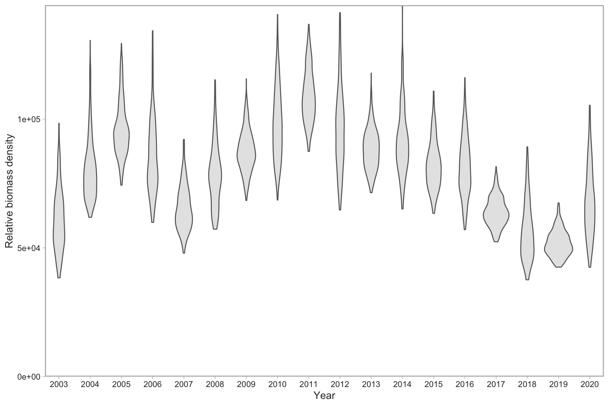
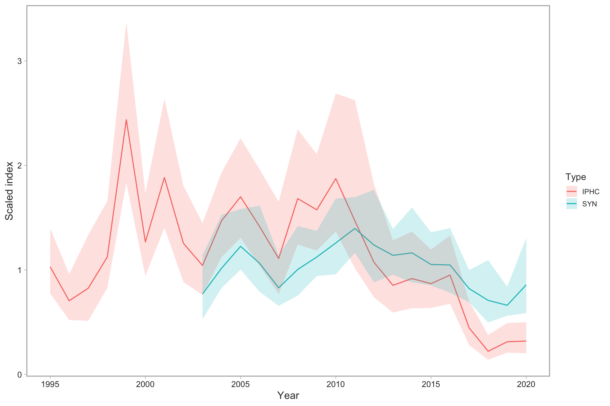
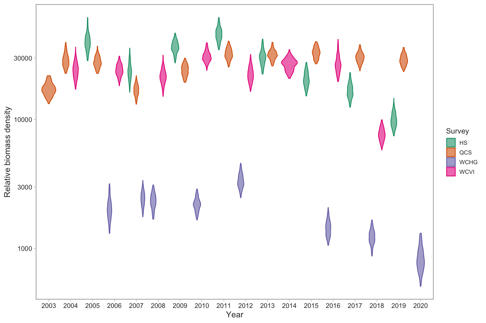

background-image: url(figs/arrowtooth_flounder.jpeg)

```{r setup, include=FALSE, echo=FALSE, fig.width=8, fig.height=8}
# paste this into the console before running `xaringan::inf_mr("twg_01.Rmd")`
# to make your entries faster (fraction of a second)
# options(servr.interval = 0.1)

fig_asp <- 0.618
fig_width <- 9
fig_out_width <- "6in"
fig_dpi <- 180
fig_align <- "center"
user <- Sys.getenv("USER")
knitr::opts_chunk$set(
  collapse = TRUE,
  warning = FALSE,
  message = FALSE,
  comment = "#>",
  fig.asp = fig_asp,
  fig.width = fig_width,
  fig.path = "_bookdown_files/knitr-cache/",
  cache.path = "_bookdown_files/knitr-cache/",
  echo = FALSE,
  cache.comments = FALSE,
  dev = "png",
  dpi = fig_dpi,
  fig.align = fig_align,
  autodep = isTRUE(user == "seananderson"),
  cache = isTRUE(user == "seananderson")
)

french <- FALSE

options(htmltools.dir.version = FALSE)
library(cowplot)
library(csasdown)
library(dplyr)
library(here)
library(gfplot)
library(ggplot2)
library(knitr)
library(kableExtra)
library(purrr)
library(tibble)
library(tidyr)
#devtools::load_all(file.path(dirname(here()), "gfplot"))
#library(arrowtooth)
devtools::load_all(here::here())

main_dirs <- set_dirs(nongit_dir = file.path(dirname(here()), "arrowtooth-nongit"))
nongit_dir <- main_dirs$nongit_dir
if(!exists("dat")){
  fn <- file.path(nongit_dir, "data", "arrowtooth-flounder-june11-2021.rds")
  if(!file.exists(fn)){
    stop("Data file ", fn, " does not exist", call. = FALSE)
  }
  dat <- readRDS(fn)
}
pres_dir <- file.path(nongit_dir, "presentations", "pre-review")
dir.create(pres_dir, recursive = TRUE, showWarnings = FALSE)
survey_index <- dat$survey_index
survey_sets <- dat$survey_sets
survey_samples <- dat$survey_samples
commercial_samples <- dat$commercial_samples
catch <- dat$catch
cpue_spatial <- dat$cpue_spatial
catch_spatial <- dat$catch_spatial
cpue_spatial_ll <- dat$cpue_spatial_ll
age_precision <- dat$age_precision

# Make a tibble in ggplot format with length-based and possibly age-based sex proportions by year
get_female_props <- function(ac = NULL, lc){
  if(!is.null(ac)){
    ac_all <- ac %>% group_by(year) %>% summarize(num = n())
    ac_fem <- ac %>% group_by(year) %>% filter(sex == "F") %>% summarize(num = n())
    ac_all <- ac_all %>%
      left_join(ac_fem, by = "year") %>% 
      rename(all = num.x, female = num.y) %>%
      mutate(female_prop = round(female / all, 2),
             male_prop = round(1 - female_prop, 2)) 
    ac_all <- ac_all %>% 
      select(year, female_prop) %>% 
      mutate(type = "Age")
  }
  
  lc_all <- lc %>% group_by(year) %>% summarize(num = n())
  lc_fem <- lc %>% group_by(year) %>% filter(sex == "F") %>% summarize(num = n())
  lc_all <- lc_all %>%
    left_join(lc_fem, by = "year") %>% 
    rename(all = num.x, female = num.y) %>%
    mutate(female_prop = round(female / all, 2),
           male_prop = round(1 - female_prop, 2)) 
  lc_all <- lc_all %>% 
    select(year, female_prop) %>% 
    mutate(type = "Length")
  
  if(is.null(ac)){
    lc_all %>% 
      rename(Year = year, `Proportion female` = female_prop, `Type` = type)
  }else{
    bind_rows(ac_all, lc_all) %>% 
      rename(Year = year, `Proportion female` = female_prop, `Type` = type)
  }
}

# Commercial samples
# Coastwide
ct_coast <- tidy_catch(catch, areas = NULL)
ct_areas <- tidy_catch(catch, areas = c("3[CD]+", "5[ABCDE]+"))
ct_areas_fine <- tidy_catch(catch, areas = c("3[CD]+", "5[AB]+", "5[CD]", "5[E]"))
ac_coast <- tidy_ages_weighted(commercial_samples, sample_type = "commercial", dat_catch = catch)
lc_coast <- tidy_lengths_weighted(commercial_samples, sample_type = "commercial", dat_catch = catch)
ac_lc_coast <- get_female_props(ac_coast, lc_coast) %>% mutate(Area = "Coastwide")
lwf_coast <- fit_length_weight(commercial_samples, sex = "female")
lwm_coast <- fit_length_weight(commercial_samples, sex = "male")
num_m_coast <- commercial_samples %>% filter(!is.na(weight) & !is.na(length), sex == 1) %>% nrow
num_f_coast <- commercial_samples %>% filter(!is.na(weight) & !is.na(length), sex == 2) %>% nrow
# 3CD
cs_3cd <- commercial_samples %>% filter(grepl("^3[C|D].*", major_stat_area_name))
ac_3cd <- tidy_ages_weighted(cs_3cd, sample_type = "commercial", dat_catch = catch)
lc_3cd <- tidy_lengths_weighted(cs_3cd, sample_type = "commercial", dat_catch = catch)
ac_lc_3cd <- get_female_props(ac_3cd, lc_3cd) %>% mutate(Area = "3CD")
lwf_3cd <- fit_length_weight(cs_3cd, sex = "female")
lwm_3cd <- fit_length_weight(cs_3cd, sex = "male")
num_m_3cd <- cs_3cd %>% filter(!is.na(weight) & !is.na(length), sex == 1) %>% nrow
num_f_3cd <- cs_3cd %>% filter(!is.na(weight) & !is.na(length), sex == 2) %>% nrow
# 5AB
cs_5ab <- commercial_samples %>% filter(grepl("^5[A|B].*", major_stat_area_name))
ac_5ab <- tidy_ages_weighted(cs_5ab, sample_type = "commercial", dat_catch = catch)
lc_5ab <- tidy_lengths_weighted(cs_5ab, sample_type = "commercial", dat_catch = catch)
ac_lc_5ab <- get_female_props(ac_5ab, lc_5ab) %>% mutate(Area = "5AB")
lwf_5ab <- fit_length_weight(cs_5ab, sex = "female")
lwm_5ab <- fit_length_weight(cs_5ab, sex = "male", min_samples = 25)
num_m_5ab <- cs_5ab %>% filter(!is.na(weight) & !is.na(length), sex == 1) %>% nrow
num_f_5ab <- cs_5ab %>% filter(!is.na(weight) & !is.na(length), sex == 2) %>% nrow
# 5CD
cs_5cd <- commercial_samples %>% filter(grepl("^5[C|D].*", major_stat_area_name))
ac_5cd <- tidy_ages_weighted(cs_5cd, sample_type = "commercial", dat_catch = catch)
lc_5cd <- tidy_lengths_weighted(cs_5cd, sample_type = "commercial", dat_catch = catch)
ac_lc_5cd <- get_female_props(ac_5cd, lc_5cd) %>% mutate(Area = "5CD")
lwf_5cd <- fit_length_weight(cs_5cd, sex = "female")
lwm_5cd <- fit_length_weight(cs_5cd, sex = "male")
num_m_5cd <- cs_5cd %>% filter(!is.na(weight) & !is.na(length), sex == 1) %>% nrow
num_f_5cd <- cs_5cd %>% filter(!is.na(weight) & !is.na(length), sex == 2) %>% nrow
# 5E
cs_5e <- commercial_samples %>% filter(grepl("^5[E].*", major_stat_area_name))
lc_5e <- tidy_lengths_weighted(cs_5e, sample_type = "commercial", dat_catch = catch)
ac_lc_5e <- get_female_props(lc = lc_5e) %>% mutate(Area = "5E")
lwf_5e <- fit_length_weight(cs_5e, sex = "female")
lwm_5e <- fit_length_weight(cs_5e, sex = "male")
num_m_5e <- cs_5e %>% filter(!is.na(weight) & !is.na(length), sex == 1) %>% nrow
num_f_5e <- cs_5e %>% filter(!is.na(weight) & !is.na(length), sex == 2) %>% nrow

ac_lc <- bind_rows(ac_lc_coast, ac_lc_3cd, ac_lc_5ab, ac_lc_5cd, ac_lc_5e)

# Survey samples
# Coastwide
ss_coast <- survey_samples %>%
  filter(survey_abbrev %in% c("SYN WCVI", "SYN QCS", "SYN HS", "HS MSA"))
as_coast <- ss_coast %>%
  tidy_ages_weighted(sample_type = "survey",
                     dat_survey_sets = survey_sets) %>% 
  mutate(survey_abbrev = as.character(survey_abbrev))
ls_coast <- tidy_lengths_weighted(survey_samples,
                                  sample_type = "survey",
                                  dat_survey_sets = survey_sets)
as_ls_coast <- get_female_props(as_coast, ls_coast) %>% mutate(Area = "All surveys")
# 3CD
ss_3cd <- survey_samples %>% filter(survey_abbrev == "SYN WCVI")
as_3cd <- tidy_ages_weighted(ss_3cd, sample_type = "survey", dat_survey_sets = survey_sets)
ls_3cd <- tidy_lengths_weighted(ss_3cd, sample_type = "survey", dat_survey_sets = survey_sets)
as_ls_3cd <- get_female_props(as_3cd, ls_3cd) %>% mutate(Area = "SYN WCVI")
# 5AB
ss_5ab <- survey_samples %>% filter(survey_abbrev == "SYN QCS")
as_5ab <- tidy_ages_weighted(ss_5ab, sample_type = "survey", dat_survey_sets = survey_sets)
ls_5ab <- tidy_lengths_weighted(ss_5ab, sample_type = "survey", dat_survey_sets = survey_sets)
as_ls_5ab <- get_female_props(as_5ab, ls_5ab) %>% mutate(Area = "SYN QCS")
# 5CD
ss_5cd <- survey_samples %>% filter(survey_abbrev == "SYN HS")
as_5cd <- tidy_ages_weighted(ss_5cd, sample_type = "survey", dat_survey_sets = survey_sets)
ls_5cd <- tidy_lengths_weighted(ss_5cd, sample_type = "survey", dat_survey_sets = survey_sets)
as_ls_5cd <- get_female_props(as_5cd, ls_5cd) %>% mutate(Area = "SYN HS")
# 5E
ss_5e <- survey_samples %>% filter(survey_abbrev == "SYN WCHG")
ls_5e <- tidy_lengths_weighted(ss_5e, sample_type = "survey", dat_survey_sets = survey_sets)
as_ls_5e <- get_female_props(lc = ls_5e) %>% mutate(Area = "SYN WCHG")

as_ls <- bind_rows(as_ls_coast, as_ls_3cd, as_ls_5ab, as_ls_5cd, as_ls_5e)

theme_set(theme_pbs())
```

```{r xaringan-themer, include=FALSE, warning=FALSE}
library(xaringanthemer)
style_mono_accent(
  base_color = "#1c5253",
  header_font_google = google_font("Josefin Sans"),
  text_font_google   = google_font("Montserrat", "300", "300i"),
  code_font_google   = google_font("Fira Mono")
)
```

---
class: center, middle, inverse

# Commercial Fishery

---
class: center
### Introduction

.left[
- Caught mainly by bottom trawl, from large freezer trawlers

- Prior to arrival of freezer trawlers (2006 forward), much of the catch was discarded at sea due to proteolysis

- Catch data prior to 1996 are unreliable due to lack of reporting of discards. Entire tows were discarded without report often.

- Previous assessment: Grandin & Forrest, 2017 (modeling and assessment took place in 2015 for years 1996-2014)
  - Female-only, coastwide catch-age model (iSCAM)
  
- This assessment will include data from 1996-2019
  - Additional ageing done to cover 2015-2019 for fishery and synoptic surveys
]

---
class: center
### Management

.left[
- Managed as a coastwide stock

- Recent measures imposed while waiting for advice from this stock assessment

  - Reduced 2019/2020 carryover allowance from 30% to 10%

  - Reduced TAC from 14,000 t to 5,000 t in 2020/2021

  - Reduced temporary quota size from 16% to 8% of the TAC

  - Implementation of spatial closures from Nov 1 to March 31 to limit harvest on spawners
]

---
class: center
### Management Areas
```{r management-areas, out.width = 550}
include_graphics("figs/management_areas.png")
```

---
class: center
### Catch / CPUE Coastwide 2007-2020
.left-fig[
```{r catch-spatial-all, fig.dim = c(4.8, 4.5), out.width = "100%"}
plot_catch_spatial(catch_spatial %>% filter(year %in% 2007:2020),
                        bin_width = 10,
                        bath = c(100, 200, 500, 1000, 1500)) +
  theme(axis.text.x = element_text(angle = 0)) +
  ggtitle("2007-2020") +
  theme(plot.title = element_text(size = 20, face = "bold")) +
  scale_x_continuous(breaks = seq(from = 1900, to = 2100, by = 5))

```
]
.right-fig[
```{r cpue-spatial-all, echo = FALSE, fig.dim = c(4.8, 4.5), out.width = "100%"}
plot_cpue_spatial(cpue_spatial %>% filter(year %in% 2007:2020),
                       bin_width = 10,
                       bath = c(100, 200, 500, 1000, 1500)) +
  theme(axis.text.x = element_text(angle = 0)) +
  ggtitle("2007-2020") +
  theme(plot.title = element_text(size = 20, face = "bold")) +
  scale_x_continuous(breaks = seq(from = 1900, to = 2100, by = 5))

```
]

---
class: center
### Catch / CPUE Coastwide 2015
.left-fig[
```{r catch-spatial-2015, fig.dim = c(4.8, 4.5), out.width = "100%"}
plot_catch_spatial(catch_spatial %>% filter(year == 2015),
                        bin_width = 10,
                        bath = c(100, 200, 500, 1000, 1500)) +
  theme(axis.text.x = element_text(angle = 0)) +
  ggtitle("2015") +
  theme(plot.title = element_text(size = 20, face = "bold")) +
  scale_x_continuous(breaks = seq(from = 1900, to = 2100, by = 5))

```
]
.right-fig[
```{r cpue-spatial-2015, echo = FALSE, fig.dim = c(4.8, 4.5), out.width = "100%"}
plot_cpue_spatial(cpue_spatial %>% filter(year == 2015),
                       bin_width = 10,
                       bath = c(100, 200, 500, 1000, 1500)) +
  theme(axis.text.x = element_text(angle = 0)) +
  ggtitle("2015") +
  theme(plot.title = element_text(size = 20, face = "bold")) +
  scale_x_continuous(breaks = seq(from = 1900, to = 2100, by = 5))

```
]

---
class: center
### Catch / CPUE Coastwide 2016
.left-fig[
```{r catch-spatial-2016, fig.dim = c(4.8, 4.5), out.width = "100%"}
plot_catch_spatial(catch_spatial %>% filter(year == 2016),
                        bin_width = 10,
                        bath = c(100, 200, 500, 1000, 1500)) +
  theme(axis.text.x = element_text(angle = 0)) +
  ggtitle("2016") +
  theme(plot.title = element_text(size = 20, face = "bold")) +
  scale_x_continuous(breaks = seq(from = 1900, to = 2100, by = 5))

```
]
.right-fig[
```{r cpue-spatial-2016, echo = FALSE, fig.dim = c(4.8, 4.5), out.width = "100%"}
plot_cpue_spatial(cpue_spatial %>% filter(year == 2016),
                       bin_width = 10,
                       bath = c(100, 200, 500, 1000, 1500)) +
  theme(axis.text.x = element_text(angle = 0)) +
  ggtitle("2016") +
  theme(plot.title = element_text(size = 20, face = "bold")) +
  scale_x_continuous(breaks = seq(from = 1900, to = 2100, by = 5))

```
]

---
class: center
### Catch / CPUE Coastwide 2017
.left-fig[
```{r catch-spatial-2017, fig.dim = c(4.8, 4.5), out.width = "100%"}
plot_catch_spatial(catch_spatial %>% filter(year == 2017),
                        bin_width = 10,
                        bath = c(100, 200, 500, 1000, 1500)) +
  theme(axis.text.x = element_text(angle = 0)) +
  ggtitle("2017") +
  theme(plot.title = element_text(size = 20, face = "bold")) +
  scale_x_continuous(breaks = seq(from = 1900, to = 2100, by = 5))

```
]
.right-fig[
```{r cpue-spatial-2017, echo = FALSE, fig.dim = c(4.8, 4.5), out.width = "100%"}
plot_cpue_spatial(cpue_spatial %>% filter(year == 2017),
                       bin_width = 10,
                       bath = c(100, 200, 500, 1000, 1500)) +
  theme(axis.text.x = element_text(angle = 0)) +
  ggtitle("2017") +
  theme(plot.title = element_text(size = 20, face = "bold")) +
  scale_x_continuous(breaks = seq(from = 1900, to = 2100, by = 5))

```
]

---
class: center
### Catch / CPUE Coastwide 2018
.left-fig[
```{r catch-spatial-2018, fig.dim = c(4.8, 4.5), out.width = "100%"}
plot_catch_spatial(catch_spatial %>% filter(year == 2018),
                        bin_width = 10,
                        bath = c(100, 200, 500, 1000, 1500)) +
  theme(axis.text.x = element_text(angle = 0)) +
  ggtitle("2018") +
  theme(plot.title = element_text(size = 20, face = "bold")) +
  scale_x_continuous(breaks = seq(from = 1900, to = 2100, by = 5))

```
]
.right-fig[
```{r cpue-spatial-2018, echo = FALSE, fig.dim = c(4.8, 4.5), out.width = "100%"}
plot_cpue_spatial(cpue_spatial %>% filter(year == 2018),
                       bin_width = 10,
                       bath = c(100, 200, 500, 1000, 1500)) +
  theme(axis.text.x = element_text(angle = 0)) +
  ggtitle("2018") +
  theme(plot.title = element_text(size = 20, face = "bold")) +
  scale_x_continuous(breaks = seq(from = 1900, to = 2100, by = 5))

```
]

---
class: center
### Catch / CPUE Coastwide 2019
.left-fig[
```{r catch-spatial-2019, fig.dim = c(4.8, 4.5), out.width = "100%"}
plot_catch_spatial(catch_spatial %>% filter(year == 2019),
                        bin_width = 10,
                        bath = c(100, 200, 500, 1000, 1500)) +
  theme(axis.text.x = element_text(angle = 0)) +
  ggtitle("2019") +
  theme(plot.title = element_text(size = 20, face = "bold")) +
  scale_x_continuous(breaks = seq(from = 1900, to = 2100, by = 5))

```
]
.right-fig[
```{r cpue-spatial-2019, echo = FALSE, fig.dim = c(4.8, 4.5), out.width = "100%"}
plot_cpue_spatial(cpue_spatial %>% filter(year == 2019),
                       bin_width = 10,
                       bath = c(100, 200, 500, 1000, 1500)) +
  theme(axis.text.x = element_text(angle = 0)) +
  ggtitle("2019") +
  theme(plot.title = element_text(size = 20, face = "bold")) +
  scale_x_continuous(breaks = seq(from = 1900, to = 2100, by = 5))

```
]

---
class: center
### Catch / CPUE Coastwide 2020
.left-fig[
```{r catch-spatial-2020, fig.dim = c(4.8, 4.5), out.width = "100%"}
plot_catch_spatial(catch_spatial %>% filter(year == 2020),
                        bin_width = 10,
                        bath = c(100, 200, 500, 1000, 1500)) +
  theme(axis.text.x = element_text(angle = 0)) +
  ggtitle("2020") +
  theme(plot.title = element_text(size = 20, face = "bold")) +
  scale_x_continuous(breaks = seq(from = 1900, to = 2100, by = 5))

```
]
.right-fig[
```{r cpue-spatial-2020, echo = FALSE, fig.dim = c(4.8, 4.5), out.width = "100%"}
plot_cpue_spatial(cpue_spatial %>% filter(year == 2020),
                       bin_width = 10,
                       bath = c(100, 200, 500, 1000, 1500)) +
  theme(axis.text.x = element_text(angle = 0)) +
  ggtitle("2020") +
  theme(plot.title = element_text(size = 20, face = "bold")) +
  scale_x_continuous(breaks = seq(from = 1900, to = 2100, by = 5))

```
]


---
class: center
### Total coastwide catch
```{r main-catches}
plot_catch(ct_coast, french = french, xlim = c(start_catch_yr, end_catch_yr)) +
  theme(axis.text.x = element_text(angle = 0)) +
  ggtitle(NULL) +
  scale_x_continuous(breaks = seq(from = 1900, to = 2100, by = 5))
```

---
class: center
### Total catch split North/South
```{r main-catches-by-area}
# Place North on top and South on bottom for facets
ct_areas$area <- factor(ct_areas$area, levels = rev(unique(ct_areas$area)))
plot_catch(ct_areas, french = french, xlim = c(start_catch_yr, end_catch_yr)) +
  theme(axis.text.x = element_text(angle = 0)) +
  ggtitle(NULL) +
  scale_x_continuous(breaks = seq(from = 1900, to = 2100, by = 5))
```

---
class: center
### Total catch by area
```{r main-catches-by-area-fine}
# Place North on top and South on bottom for facets
ct_areas_fine$area <- factor(ct_areas_fine$area, levels = rev(unique(ct_areas_fine$area)))
plot_catch(ct_areas_fine, french = french, xlim = c(start_catch_yr, end_catch_yr)) +
  theme(axis.text.x = element_text(angle = 0)) +
  ggtitle(NULL) +
  scale_x_continuous(breaks = seq(from = 1900, to = 2100, by = 5))
```

---
class: center
### Number of fishery age observations
```{r age-freq}
j <- map2(list(commercial_samples, cs_3cd, cs_5ab, cs_5cd, cs_5e),
          c("Coastwide", "3CD", "5AB", "5CD", "5E"), ~{
  .x %>%
    select(year, sex, age) %>%
    filter(!is.na(age)) %>% 
    mutate(sex = ifelse(sex == 1, "Male", ifelse(sex == 2, "Female", "Not recorded"))) %>% 
              rename(Year = year, Age = age, Sex = sex) %>% 
              mutate(Area = .y)}) %>% 
  map_df(~{.x}) %>% 
  complete(Year, Sex, Area)

ggplot(j, aes(x = Year, fill = Sex, color = Sex)) +
  geom_bar() +
  scale_fill_manual(values = c(Female = "#FF00001A", Male = "#0000FF1A", `Not recorded` = "#6666661A"),
                    aesthetics = "fill") +
  scale_color_manual(values = c(Female = "red", Male = "blue", `Not recorded` = "grey40"),
                    aesthetics = "color") +
  facet_wrap(~ Area) +
  ylab("Number of length records") +
  scale_y_continuous(labels = scales::comma)
```

---
class: center
### Age proportions coastwide
```{r age-comps}
plot_ages(ac_coast, diagonal_lines = NA) +
  theme(axis.text.x = element_text(angle = 0, hjust = 0.5)) +
  scale_color_manual(values = c(F = "#FF000080", M = "#0000FF80"),
                    aesthetics = "color") +
  ggtitle(NULL) +
  scale_x_continuous(breaks = seq(from = 1900, to = 2100, by = 1))
```

---
class: center
### Age proportions area 3CD
```{r age-comps-3cd}
plot_ages(ac_3cd, diagonal_lines = NA) +
  theme(axis.text.x = element_text(angle = 0, hjust = 0.5)) +
  scale_color_manual(values = c(F = "#FF000080", M = "#0000FF80"),
                    aesthetics = "color") +
  ggtitle(NULL) +
  scale_x_continuous(breaks = seq(from = 1900, to = 2100, by = 1))
```

---
class: center
### Age proportions area 5AB
```{r age-comps-5ab}
plot_ages(ac_5ab, diagonal_lines = NA) +
  theme(axis.text.x = element_text(angle = 0, hjust = 0.5)) +
  scale_color_manual(values = c(F = "#FF000080", M = "#0000FF80"),
                    aesthetics = "color") +
  ggtitle(NULL) +
  scale_x_continuous(breaks = seq(from = 1900, to = 2100, by = 1))
```

---
class: center
### Age proportions area 5CD
```{r age-comps-5cd}
plot_ages(ac_5cd, diagonal_lines = NA) +
  theme(axis.text.x = element_text(angle = 0, hjust = 0.5)) +
  scale_color_manual(values = c(F = "#FF000080", M = "#0000FF80"),
                    aesthetics = "color") +
  ggtitle(NULL) +
  scale_x_continuous(breaks = seq(from = 1900, to = 2100, by = 1))
```

---
class: center
### Number of fishery length observations
```{r length-freq}
k <- map2(list(cs_3cd, cs_5ab, cs_5cd, cs_5e),
          c("3CD", "5AB", "5CD", "5E"), ~{
  .x %>%
    select(year, sex, length) %>%
    filter(!is.na(length)) %>% 
    mutate(sex = ifelse(sex == 1, "Male", ifelse(sex == 2, "Female", "Not recorded"))) %>% 
              rename(Year = year, Length = length, Sex = sex) %>% 
              mutate(Area = .y)}) %>% 
  map_df(~{.x}) %>% 
  complete(Year, Sex, Area)

ggplot(k, aes(x = Year, fill = Sex, color = Sex)) +
  geom_bar() +
  scale_fill_manual(values = c(Female = "#FF00001A", Male = "#0000FF1A", `Not recorded` = "#6666661A"),
                    aesthetics = "fill") +
  scale_color_manual(values = c(Female = "red", Male = "blue", `Not recorded` = "grey40"),
                    aesthetics = "color") +
  facet_wrap(~ Area) +
  ylab("Number of length records") +
  scale_y_continuous(labels = scales::comma)
```

---
class: center
### Number of fishery length observations coastwide
```{r length-freq-coastwide}
j <- commercial_samples %>% 
  select(year, sex, length) %>%
  filter(!is.na(length)) %>% 
  mutate(sex = ifelse(sex == 1, "Male", ifelse(sex == 2, "Female", "Not recorded"))) %>% 
  rename(Year = year, Length = length, Sex = sex) %>% 
  complete(Year, Sex) 

ggplot(j, aes(x = Year, fill = Sex, color = Sex)) +
  geom_bar() +
  scale_fill_manual(values = c(Female = "#FF00001A", Male = "#0000FF1A", `Not recorded` = "#6666661A"),
                    aesthetics = "fill") +
  scale_color_manual(values = c(Female = "red", Male = "blue", `Not recorded` = "grey40"),
                    aesthetics = "color") +
  ylab("Number of length records") +
  scale_y_continuous(labels = scales::comma)
```

---
class: center
### Length proportions coastwide
```{r length-comps}
fm_fill_colors <- c(M = "#0000FF1A", F = "#FF00001A")
fm_line_colors <- c(M = "blue", F = "red")
plot_lengths(lc_coast, show_year = "even", fill_col = fm_fill_colors, line_col = fm_line_colors) +
  ggtitle(NULL) +
  scale_x_continuous(breaks = seq(from = 0, to = 100, by = 5))
```

---
class: center
### Length proportions 3CD
```{r length-comps-3cd}
plot_lengths(lc_3cd, show_year = "even", fill_col = fm_fill_colors, line_col = fm_line_colors) +
  ggtitle(NULL) +
  scale_x_continuous(breaks = seq(from = 0, to = 100, by = 5))
```

---
class: center
### Length proportions 5AB
```{r length-comps-5ab}
plot_lengths(lc_5ab, show_year = "even", fill_col = fm_fill_colors, line_col = fm_line_colors) +
  ggtitle(NULL) +
  scale_x_continuous(breaks = seq(from = 0, to = 100, by = 5))
```

---
class: center
### Length proportions 5CD
```{r length-comps-5cd}
plot_lengths(lc_5cd, show_year = "all", fill_col = fm_fill_colors, line_col = fm_line_colors) +
  ggtitle(NULL) +
  scale_x_continuous(breaks = seq(from = 0, to = 100, by = 5))
```

---
class: center
### Length proportions 5E
```{r length-comps-5e}
plot_lengths(lc_5e, show_year = "all", fill_col = fm_fill_colors, line_col = fm_line_colors) +
  ggtitle(NULL) +
  scale_x_continuous(breaks = seq(from = 0, to = 100, by = 5))
```

---
class: center
### Length-weight relationships

```{r lw-relationship}
fm_color <- c(Male = "blue", Female = "red")
plot_grid(plot_length_weight(lwf_3cd, lwm_3cd, col = fm_color) +
            theme(legend.position = "none") +
            ggtitle(paste0("3CD (", num_f_3cd, " F, ", num_m_3cd, " M)")),
          plot_length_weight(lwf_5ab, lwm_5ab, col = fm_color) +
            theme(legend.position = "none") +
            ggtitle(paste0("5AB (", num_f_5ab, " F, ", num_m_5ab, " M)")),
          plot_length_weight(lwf_5cd, lwm_5cd, col = fm_color) +
            theme(legend.position = "none") +
            ggtitle(paste0("5CD (", num_f_5cd, " F, ", num_m_5cd, " M)")),
          plot_length_weight(lwf_5e, lwm_5e, col = fm_color) +
            theme(legend.position = "none") +
            ggtitle(paste0("5E (", num_f_5e, " F, ", num_m_5e, " M)")),
          plot_length_weight(lwf_coast, lwm_coast, col = fm_color) +
            theme(legend.position = "none") +
            ggtitle(paste0("Coastwide (", num_f_coast, " F, ", num_m_coast, " M)")),
          ncol = 3,
          nrow = 2)
```

---
class: center
### Coastwide sex proportions with weighting applied

```{r sex-prop-weighting-older, echo = FALSE, message = FALSE}
unsorted_only <- props_comm(commercial_samples,
                            areas = c("03", "04", "05", "06", "07", "08", "09"),
                            start_year = 1996,
                            species_category = c(1),
                            sample_type = c(1, 2, 6, 7, 8),
                            gear = c(1, 8),
                            data_source_name = "Unsorted only")
un_keep <- props_comm(commercial_samples,
                      areas = c("03", "04", "05", "06", "07", "08", "09"),
                      start_year = 1996,
                      species_category = c(1, 3),
                      sample_type = c(1, 2, 6, 7, 8),
                      gear = c(1, 8),
                      data_source_name = "Unsorted + Keepers")
un_keep_disc <- props_comm(commercial_samples,
                           areas = c("03", "04", "05", "06", "07", "08", "09"),
                           start_year = 1996,
                           species_category = c(1, 3, 4),
                           sample_type = c(1, 2, 6, 7, 8),
                           gear = c(1, 8),
                           data_source_name = "Unsorted + Keepers + Discards")

j <- bind_rows(unsorted_only, un_keep, un_keep_disc) %>% 
  pivot_wider(id_cols = "year", names_from = "data_source", values_from = prop_female) %>% 
  arrange(year) %>% 
  rename(Year = year) %>% 
  mutate_at(.vars = vars(-Year), function(x){format(round(x, 2), nsmall = 2)}) %>% 
  map_df(~{
    .x[grep("NA", .x)] <- ""
    .x
  })

older <- j %>% filter(Year <= 2007)
newer <- j %>% filter(Year > 2007 & Year < 2020)
kable(older, booktabs = TRUE, escape = FALSE, table.attr = "style='width:100%;'", align = c("l", rep("r", 4))) %>% 
  row_spec(seq(1, nrow(older)), background = "white") %>% 
  kable_styling(font_size = 18)

```

---
class: center
### Coastwide sex proportions with weighting applied (2)
```{r sex-prop-weighting-newer, echo = FALSE, message = FALSE}
kable(newer, booktabs = TRUE, escape = FALSE, table.attr = "style='width:100%;'", align = c("l", rep("r", 4))) %>% 
  row_spec(seq(1, nrow(newer)), background = "white") %>% 
  kable_styling(font_size = 18)
```

---
class: center
### Coastwide sex proportions with weighting applied (3)
```{r sex-prop-comparison-plot}
k <- bind_rows(unsorted_only, un_keep, un_keep_disc) %>% 
  rename(Year = year,
         `Proportion female` = prop_female,
         `Type` = data_source) %>% 
  mutate(Type = forcats::fct_relevel(Type,
                                     c("Unsorted only",
                                       "Unsorted + Keepers",
                                       "Unsorted + Keepers + Discards")))
ggplot(k, aes(x = Year, y = `Proportion female`, color = `Type`)) +
  geom_line(size = 1) +
  geom_hline(yintercept = c(0.5, 0.75), linetype = "dashed") +
  coord_cartesian(ylim = c(0, 1)) 
```

---
class: center
### Coastwide sex proportions with weighting applied (4)
```{r sex-prop-weighting-with-surveys, echo = FALSE, message = FALSE}
out_dir <- file.path(nongit_dir, "data-output")
fn <- file.path(out_dir, "all-proportion-female.rds")
if(!dir.exists(out_dir)){
  dir.create(out_dir)
}
if(file.exists(fn)){
  all_props <- readRDS(fn)
}else{
  all_props <- props_all(comm_samples = commercial_samples,
                         surv_sets = survey_sets,
                         surv_samples = survey_samples,
                         surv_series = 1:4,
                         surv_series_names = c("qcsss", "hsmas", "hsss", "wcviss"),
                         start_year = 1996,
                         end_year = 2019,
                         species_category = c(1),
                         sample_type = c(1, 2, 6, 7, 8),
                         gear = c(1, 8))
  saveRDS(all_props, fn)  
}

all_props <- all_props %>% pivot_wider(id_cols = "year", names_from = "data_source", values_from = "prop_female") %>% 
  mutate_at(.vars = vars(-year), ~{format(round(.x, 2), nsmall = 2)}) %>% 
  map_df(~{
    .x[grep("NA", .x)] <- ""
    .x
  }) %>% 
  rename(`Year` = "year",
         `QCS Synoptic` = "qcsss",
         `HS Multispecies` = "hsmas",
         `HS Synoptic` = "hsss",
         `WCVI Synoptic` = "wcviss")

all_props_older <- all_props %>% filter(Year <= 2007)
all_props_newer <- all_props %>% filter(Year > 2007)
    
kable(all_props_older, booktabs = TRUE, escape = FALSE, table.attr = "style='width:100%;'") %>% 
  row_spec(seq(1, nrow(all_props_older)), background = "white") %>% 
  kable_styling(font_size = 18)
```

---
class: center
### Coastwide sex proportions with weighting applied (5)
```{r sex-prop-weighting-with-surveys-2, echo = FALSE, message = FALSE}
kable(all_props_newer, booktabs = TRUE, escape = FALSE, table.attr = "style='width:100%;'") %>% 
  row_spec(seq(1, nrow(all_props_newer)), background = "white") %>% 
  kable_styling(font_size = 18)
```

---
class: center
### Coastwide sex proportions with weighting applied (6)
```{r sex-prop-comparison-with-surveys-plot}
k <- all_props %>%
  select(Year, Coastwide, `3CD`, `5ABCDE`) %>% 
  pivot_longer(c("Coastwide",
                 "3CD",
                 "5ABCDE"), names_to = "Area", values_to = "Proportion female") %>% 
  mutate(`Proportion female` = ifelse(`Proportion female` == "", NA, as.numeric(`Proportion female`))) %>% 
  mutate(Year = as.numeric(Year)) %>% 
  mutate(Area = forcats::fct_relevel(Area,
                                     c("Coastwide",
                                       "3CD",
                                       "5ABCDE")))
ggplot(k, aes(x = Year, y = `Proportion female`, color = `Area`)) +
  geom_line(size = 1) +
  geom_hline(yintercept = c(0.5, 0.75), linetype = "dashed") +
  coord_cartesian(ylim = c(0, 1)) 
```

---
class: center, inverse, middle
# Survey data

---
class: center
### Sample availibility

```{r sample-availability}
surv_samp <- tidy_sample_avail(survey_samples)
plot_sample_avail(surv_samp, palette = "Greens", text_colour = "black")
```

---
class: center, inverse, middle
# Last 3 Survey biomass maps for SYN WCVI

---
class: center
### Survey biomass for SYN WCVI 2014

```{r survey-sets-wcvi-2014}
rds_file <- file.path(pres_dir, "survey-sets-wcvi-2014.rds")
if(file.exists(rds_file)){
  surv_sets <- readRDS(rds_file)
}else{
  surv_sets <- fit_survey_sets(survey_sets,
                               years = 2014,
                               survey = "SYN WCVI")
  saveRDS(surv_sets, rds_file)    
}
plot_survey_sets(surv_sets$predictions,
                 surv_sets$data, 
                 fill_column = "combined",
                 pos_pt_col = "#FFFFFF4D",
                 bin_pt_col = "#FFFFFF1A",
                 pos_pt_fill = "#FFFFFF1A") +
  theme(plot.title = element_text(size = 24, face = "bold")) +
  scale_size_continuous(limits = c(0, 5000)) +
  scale_colour_viridis_c(trans = "sqrt", option = "C", limits = c(0, 0.01)) +
  scale_fill_viridis_c(trans = "sqrt", option = "C", limits = c(0, 0.01))
  
```

---
class: center
### Survey biomass for SYN WCVI 2016

```{r survey-sets-wcvi-2016}
rds_file <- file.path(pres_dir, "survey-sets-wcvi-2016.rds")
if(file.exists(rds_file)){
  surv_sets <- readRDS(rds_file)
}else{
  surv_sets <- fit_survey_sets(survey_sets,
                               years = 2016,
                               survey = "SYN WCVI")
  saveRDS(surv_sets, rds_file)    
}
plot_survey_sets(surv_sets$predictions,
                 surv_sets$data, 
                 fill_column = "combined",
                 pos_pt_col = "#FFFFFF4D",
                 bin_pt_col = "#FFFFFF1A",
                 pos_pt_fill = "#FFFFFF1A") +
  theme(plot.title = element_text(size = 24, face = "bold")) +
  scale_size_continuous(limits = c(0, 5000)) +
  scale_colour_viridis_c(trans = "sqrt", option = "C", limits = c(0, 0.01)) +
  scale_fill_viridis_c(trans = "sqrt", option = "C", limits = c(0, 0.01))
```

---
class: center
### Survey biomass for SYN WCVI 2018

```{r survey-sets-wcvi-2018}
rds_file <- file.path(pres_dir, "survey-sets-wcvi-2018.rds")
if(file.exists(rds_file)){
  surv_sets <- readRDS(rds_file)
}else{
  surv_sets <- fit_survey_sets(survey_sets,
                               years = 2018,
                               survey = "SYN WCVI")
  saveRDS(surv_sets, rds_file)    
}
plot_survey_sets(surv_sets$predictions,
                 surv_sets$data, 
                 fill_column = "combined",
                 pos_pt_col = "#FFFFFF4D",
                 bin_pt_col = "#FFFFFF1A",
                 pos_pt_fill = "#FFFFFF1A") +
  theme(plot.title = element_text(size = 24, face = "bold")) +
  scale_size_continuous(limits = c(0, 5000)) +
  scale_colour_viridis_c(trans = "sqrt", option = "C", limits = c(0, 0.01)) +
  scale_fill_viridis_c(trans = "sqrt", option = "C", limits = c(0, 0.01))
```

---
class: center, inverse, middle
# Last 3 Survey biomass maps for SYN QCS

---
class: center
### Survey biomass for SYN QCS 2015

```{r survey-sets-qcs-2015}
rds_file <- file.path(pres_dir, "survey-sets-qcs-2015.rds")
if(file.exists(rds_file)){
  surv_sets <- readRDS(rds_file)
}else{
  surv_sets <- fit_survey_sets(survey_sets,
                               years = 2015,
                               survey = "SYN QCS")
  saveRDS(surv_sets, rds_file)    
}
plot_survey_sets(surv_sets$predictions,
                 surv_sets$data, 
                 fill_column = "combined",
                 pos_pt_col = "#FFFFFF4D",
                 bin_pt_col = "#FFFFFF1A",
                 pos_pt_fill = "#FFFFFF1A") +
  theme(plot.title = element_text(size = 24, face = "bold")) +
  scale_size_continuous(limits = c(0, 5000)) +
  scale_colour_viridis_c(trans = "sqrt", option = "C", limits = c(0, 0.01)) +
  scale_fill_viridis_c(trans = "sqrt", option = "C", limits = c(0, 0.01))
```

---
class: center
### Survey biomass for SYN QCS 2017

```{r survey-sets-qcs-2017}
rds_file <- file.path(pres_dir, "survey-sets-qcs-2017.rds")
if(file.exists(rds_file)){
  surv_sets <- readRDS(rds_file)
}else{
  surv_sets <- fit_survey_sets(survey_sets,
                               years = 2017,
                               survey = "SYN QCS")
  saveRDS(surv_sets, rds_file)    
}
plot_survey_sets(surv_sets$predictions,
                 surv_sets$data, 
                 fill_column = "combined",
                 pos_pt_col = "#FFFFFF4D",
                 bin_pt_col = "#FFFFFF1A",
                 pos_pt_fill = "#FFFFFF1A") +
  theme(plot.title = element_text(size = 24, face = "bold")) +
  scale_size_continuous(limits = c(0, 5000)) +
  scale_colour_viridis_c(trans = "sqrt", option = "C", limits = c(0, 0.01)) +
  scale_fill_viridis_c(trans = "sqrt", option = "C", limits = c(0, 0.01))
```

---
class: center
### Survey biomass for SYN QCS 2019

```{r survey-sets-qcs-2019}
rds_file <- file.path(pres_dir, "survey-sets-qcs-2019.rds")
if(file.exists(rds_file)){
  surv_sets <- readRDS(rds_file)
}else{
  surv_sets <- fit_survey_sets(survey_sets,
                               years = 2019,
                               survey = "SYN QCS")
  saveRDS(surv_sets, rds_file)    
}
plot_survey_sets(surv_sets$predictions,
                 surv_sets$data, 
                 fill_column = "combined",
                 pos_pt_col = "#FFFFFF4D",
                 bin_pt_col = "#FFFFFF1A",
                 pos_pt_fill = "#FFFFFF1A") +
  theme(plot.title = element_text(size = 24, face = "bold")) +
  scale_size_continuous(limits = c(0, 5000)) +
  scale_colour_viridis_c(trans = "sqrt", option = "C", limits = c(0, 0.01)) +
  scale_fill_viridis_c(trans = "sqrt", option = "C", limits = c(0, 0.01))
```

---
class: center, inverse, middle
# Last 3 Survey biomass maps for SYN HS

---
class: center
### Survey biomass for SYN HS 2015

```{r survey-sets-hs-2015}
rds_file <- file.path(pres_dir, "survey-sets-hs-2015.rds")
if(file.exists(rds_file)){
  surv_sets <- readRDS(rds_file)
}else{
  surv_sets <- fit_survey_sets(survey_sets,
                               years = 2015,
                               survey = "SYN HS")
  saveRDS(surv_sets, rds_file)    
}
plot_survey_sets(surv_sets$predictions,
                 surv_sets$data, 
                 fill_column = "combined",
                 pos_pt_col = "#FFFFFF4D",
                 bin_pt_col = "#FFFFFF1A",
                 pos_pt_fill = "#FFFFFF1A") +
  theme(plot.title = element_text(size = 24, face = "bold")) +
  scale_size_continuous(limits = c(0, 5000)) +
  scale_colour_viridis_c(trans = "sqrt", option = "C", limits = c(0, 0.01)) +
  scale_fill_viridis_c(trans = "sqrt", option = "C", limits = c(0, 0.01))
```

---
class: center
### Survey biomass for SYN HS 2017

```{r survey-sets-hs-2017}
rds_file <- file.path(pres_dir, "survey-sets-hs-2017.rds")
if(file.exists(rds_file)){
  surv_sets <- readRDS(rds_file)
}else{
  surv_sets <- fit_survey_sets(survey_sets,
                               years = 2017,
                               survey = "SYN HS")
  saveRDS(surv_sets, rds_file)    
}
plot_survey_sets(surv_sets$predictions,
                 surv_sets$data, 
                 fill_column = "combined",
                 pos_pt_col = "#FFFFFF4D",
                 bin_pt_col = "#FFFFFF1A",
                 pos_pt_fill = "#FFFFFF1A") +
  theme(plot.title = element_text(size = 24, face = "bold")) +
  scale_size_continuous(limits = c(0, 5000)) +
  scale_colour_viridis_c(trans = "sqrt", option = "C", limits = c(0, 0.01)) +
  scale_fill_viridis_c(trans = "sqrt", option = "C", limits = c(0, 0.01))
```

---
class: center
### Survey biomass for SYN HS 2019

```{r survey-sets-hs-2019}
rds_file <- file.path(pres_dir, "survey-sets-hs-2019.rds")
if(file.exists(rds_file)){
  surv_sets <- readRDS(rds_file)
}else{
  surv_sets <- fit_survey_sets(survey_sets,
                               years = 2019,
                               survey = "SYN HS")
  saveRDS(surv_sets, rds_file)    
}
plot_survey_sets(surv_sets$predictions,
                 surv_sets$data, 
                 fill_column = "combined",
                 pos_pt_col = "#FFFFFF4D",
                 bin_pt_col = "#FFFFFF1A",
                 pos_pt_fill = "#FFFFFF1A") +
  theme(plot.title = element_text(size = 24, face = "bold")) +
  scale_size_continuous(limits = c(0, 5000)) +
  scale_colour_viridis_c(trans = "sqrt", option = "C", limits = c(0, 0.01)) +
  scale_fill_viridis_c(trans = "sqrt", option = "C", limits = c(0, 0.01))
```

---
class: center, inverse, middle
# Last 3 Survey biomass maps for SYN WCHG

---
class: center
### Survey biomass for SYN WCHG 2016

```{r survey-sets-wchg-2016}
rds_file <- file.path(pres_dir, "survey-sets-wchg-2016.rds")
if(file.exists(rds_file)){
  surv_sets <- readRDS(rds_file)
}else{
  surv_sets <- fit_survey_sets(survey_sets,
                               years = 2016,
                               survey = "SYN WCHG")
  saveRDS(surv_sets, rds_file)    
}
plot_survey_sets(surv_sets$predictions,
                 surv_sets$data, 
                 fill_column = "combined",
                 pos_pt_col = "#FFFFFF4D",
                 bin_pt_col = "#FFFFFF1A",
                 pos_pt_fill = "#FFFFFF1A") +
  theme(plot.title = element_text(size = 24, face = "bold")) +
  scale_size_continuous(limits = c(0, 5000)) +
  scale_colour_viridis_c(trans = "sqrt", option = "C", limits = c(0, 0.01)) +
  scale_fill_viridis_c(trans = "sqrt", option = "C", limits = c(0, 0.01))
```

---
class: center
### Survey biomass for SYN WCHG 2018

```{r survey-sets-wchg-2018}
rds_file <- file.path(pres_dir, "survey-sets-wchg-2018.rds")
if(file.exists(rds_file)){
  surv_sets <- readRDS(rds_file)
}else{
  surv_sets <- fit_survey_sets(survey_sets,
                               years = 2018,
                               survey = "SYN WCHG")
  saveRDS(surv_sets, rds_file)    
}
plot_survey_sets(surv_sets$predictions,
                 surv_sets$data, 
                 fill_column = "combined",
                 pos_pt_col = "#FFFFFF4D",
                 bin_pt_col = "#FFFFFF1A",
                 pos_pt_fill = "#FFFFFF1A") +
  theme(plot.title = element_text(size = 24, face = "bold")) +
  scale_size_continuous(limits = c(0, 5000)) +
  scale_colour_viridis_c(trans = "sqrt", option = "C", limits = c(0, 0.01)) +
  scale_fill_viridis_c(trans = "sqrt", option = "C", limits = c(0, 0.01))
```

---
class: center
### Survey biomass for SYN WCHG 2020

```{r survey-sets-wchg-2020}
rds_file <- file.path(pres_dir, "survey-sets-wchg-2020.rds")
if(file.exists(rds_file)){
  surv_sets <- readRDS(rds_file)
}else{
  surv_sets <- fit_survey_sets(survey_sets,
                               years = 2020,
                               survey = "SYN WCHG")
  saveRDS(surv_sets, rds_file)    
}
plot_survey_sets(surv_sets$predictions,
                 surv_sets$data, 
                 fill_column = "combined",
                 pos_pt_col = "#FFFFFF4D",
                 bin_pt_col = "#FFFFFF1A",
                 pos_pt_fill = "#FFFFFF1A") +
  theme(plot.title = element_text(size = 24, face = "bold")) +
  scale_size_continuous(limits = c(0, 5000)) +
  scale_colour_viridis_c(trans = "sqrt", option = "C", limits = c(0, 0.01)) +
  scale_fill_viridis_c(trans = "sqrt", option = "C", limits = c(0, 0.01))
```

---
class: center
### Number of SYN survey age observations
```{r survey-age-freq}
j <- map2(list(survey_samples, ss_3cd, ss_5ab, ss_5cd),
          c("Coastwide", "3CD (SYN WCVI)", "5AB (SYN QCS)", "5CD (SYN HS)"), ~{
  .x %>%
    select(year, sex, age) %>%
    filter(!is.na(age)) %>% 
    mutate(sex = ifelse(sex == 1, "Male", ifelse(sex == 2, "Female", "Not recorded"))) %>% 
              rename(Year = year, Age = age, Sex = sex) %>% 
              mutate(Area = .y)}) %>% 
  map_df(~{.x}) %>% 
  complete(Year, Sex, Area)

ggplot(j, aes(x = Year, fill = Sex, color = Sex)) +
  geom_bar() +
  scale_fill_manual(values = c(Female = "#FF00001A", Male = "#0000FF1A", `Not recorded` = "#6666661A"),
                    aesthetics = "fill") +
  scale_color_manual(values = c(Female = "red", Male = "blue", `Not recorded` = "grey40"),
                    aesthetics = "color") +
  facet_wrap(~ Area) +
  ylab("Number of length records") +
  scale_y_continuous(labels = scales::comma)
```

---
class: center
### Age proportions from surveys
```{r surveyage-comps-coastwide}
plot_ages(as_coast, diagonal_lines = NA) +
  theme(axis.text.x = element_text(angle = 45, hjust = 1)) +
  scale_color_manual(values = c(F = "#FF000080", M = "#0000FF80"),
                    aesthetics = "color") +
  ggtitle(NULL)
```

---
class: center
### Sex proportions

```{r survey-sex-comp-compare-coast}
ggplot(as_ls, aes(x = Year, y = `Proportion female`, color = `Type`)) +
  geom_line(size = 1) +
  geom_hline(yintercept = c(0.5, 0.75), linetype = "dashed") +
  coord_cartesian(ylim = c(0, 1)) +
  facet_wrap(~Area) 
  #theme_xaringan(background_color = "#FFFFFF", text_font_size = 10) 

```

---
class: center, middle, inverse
# Gulf of Alaska overview

---
class: center, inverse
### Gulf of Alaska assessment and management

.left[
- Single-area assessment

- Allowable Biological Catch (ABC) is apportioned by management area based on fraction of survey biomass in each

- Biennial assessment cycle
  - odd years have a stock assessment model run with two year projections and advice

  - even years have partial assessment showing only survey indices and catch

- Biomass for 2021 estimated at 1.325 million tonnes

- ABC for 2021 is 128,060 tonnes (F40%)

- Estimated catch for 2021 is 18,662 tonnes
]

---
class: center, inverse
### Gulf of Alaska 2019 biomass

```{r goa-bionass-2019-figure, out.width = 700}
include_graphics("figs/goa-2019-biomass.png")
```

---
class: center
### Gulf of Alaska assessment 2019 vs BC 2015

```{r goa-vs-bc}

d <- tribble(
                 ~Value,   ~`Gulf of Alaska 2019`,                 ~`BC 2015`,
      "Modeling platform",    "Stock Synthesis 3",    	              "iSCAM",
        "Number of sexes",                  "Two",             "One (Female)",
     "Commercial lengths",	      "Proxy for age",    	           "Not used",
        "Commercial ages",             "Not used",   	                 "Used",
            "Survey ages",	            "1 - 21+",                  "1 - 20+",
            "Selectivity",	          "Estimated",                "Estimated",
      "Natural mortality", "Fixed 0.2/0.35 (F/M)", "Estimated 0.314 (Female)",
    "Survey catchability",	      "Fixed q = 1.0",                "Estimated",
            "Recruitment",	          "Estimated",                "Estimated",
 "Recruitment deviations",	          "Estimated",                "Estimated",
        "Steepness of SR",	         "No SR used",                "Estimated",
    "Age ot 50% maturity",	    "Age 7 (Females)",          "Age 6 (Females)")

kable(d, booktabs = TRUE, escape = FALSE, table.attr = "style='width:100%;'") %>% 
  row_spec(seq(1, nrow(d)), background = "white") %>% 
  kable_styling(font_size = 18)
```

---
class: center
### CPUE 3CD

```{r cpue-cache-3cd}
cpue3cd <- readr::read_csv(here("presentations", "pre-review", "cpue-cached-data/cpue-predictions-arrowtooth-flounder-modern-3CD.csv"))
cpue5ab <- readr::read_csv(here("presentations", "pre-review", "cpue-cached-data/cpue-predictions-arrowtooth-flounder-modern-5AB.csv"))
cpue5cd <- readr::read_csv(here("presentations", "pre-review", "cpue-cached-data/cpue-predictions-arrowtooth-flounder-modern-5CD.csv"))
cpue5e <- readr::read_csv(here("presentations", "pre-review", "cpue-cached-data/cpue-predictions-arrowtooth-flounder-modern-5E.csv"))
cpue5abcde <- readr::read_csv(here("presentations", "pre-review", "cpue-cached-data/cpue-predictions-arrowtooth-flounder-modern-5ABCDE4B.csv"))
cpue_coast <- readr::read_csv(here("presentations", "pre-review", "cpue-cached-data/cpue-predictions-arrowtooth-flounder-modern-3CD5ABCDE.csv"))
gfplot:::plot_cpue_predictions(cpue3cd, "Combined", scale = TRUE) +
  scale_x_continuous(breaks = seq(1990, 2050, 5)) +
  facet_wrap(~formula_version)
```

---
class: center
### CPUE 5ABCDE

```{r cpue-5abcde}
gfplot:::plot_cpue_predictions(cpue5abcde, "Combined", scale = TRUE) +
  scale_x_continuous(breaks = seq(1990, 2050, 5)) +
  facet_wrap(~formula_version)
```


```{r eval=FALSE, include=FALSE}
gfplot:::plot_cpue_predictions(cpue5ab, "Combined", scale = TRUE) +
  scale_x_continuous(breaks = seq(1990, 2050, 5)) +
  facet_wrap(~formula_version) +
  ggtitle("5AB")
```


```{r, eval=FALSE, include=FALSE}
gfplot:::plot_cpue_predictions(cpue5cd, "Combined", scale = TRUE) +
  scale_x_continuous(breaks = seq(1990, 2050, 5)) +
  facet_wrap(~formula_version) +
  ggtitle("5CD")

gfplot:::plot_cpue_predictions(cpue5e, "Combined", scale = TRUE) +
  scale_x_continuous(breaks = seq(1990, 2050, 5)) +
  facet_wrap(~formula_version) +
  ggtitle("5E")

gfplot:::plot_cpue_predictions(cpue_coast, "Combined", scale = TRUE) +
  scale_x_continuous(breaks = seq(1990, 2050, 5)) +
  facet_wrap(~formula_version)
```

---
class: center
### Surveys

```{r surveys-take2}
survey_cols <- c(RColorBrewer::brewer.pal(5L, "Set1"),
      RColorBrewer::brewer.pal(8L, "Set1")[7:8],
      "#303030", "#a8a8a8", "#a8a8a8", "#a8a8a8")
survey_col_names = c("SYN WCHG", "SYN HS", "SYN QCS", "SYN WCVI",
    "HBLL OUT N", "HBLL OUT S", "IPHC FISS", "Commercial",
    "HBLL INS N", "HBLL INS S", "OTHER HS MSA")
survey_cols <- stats::setNames(survey_cols, survey_col_names)

iphc <- readRDS(here("presentations", "pre-review", "iphc-cached-data", "arrowtooth-flounder-results.rds"))
iphc <- iphc$series_ABCD_full$ser_longest

surv_indices <- tidy_survey_index(survey_index,
  survey = c(
    "SYN WCHG", "SYN HS", "SYN QCS", "SYN WCVI", 
    "HBLL OUT N", "HBLL OUT S",
    # "HBLL INS N", "HBLL INS S", 
    "OTHER HS MSA", "IPHC FISS"))

surv_indices <- filter(surv_indices, survey_abbrev != "IPHC FISS")
surv_indices <- bind_rows(surv_indices, 
  transmute(iphc, survey_abbrev = "IPHC FISS", year = year, 
    biomass = I_t20SampleMean, lowerci = I_t20BootLow, 
    upperci = I_t20BootHigh, 
    mean_cv = mean(I_t20BootCV), 
    num_sets = NA, num_pos_sets = num_pos20))

surv_indices %>% 
  filter(!(year == 2014 & survey_abbrev == "SYN WCHG")) %>%
  plot_survey_index(survey_cols = survey_cols)
```

---
class: center
### Surveys compared to CPUE

```{r cpue-vs-survey-plots}
plot_cpue_surv <- function(.survey_abbrev, cpue_dat, area_name = "") {
  ds <- filter(surv_indices, survey_abbrev == .survey_abbrev)
  ds <- filter(ds, !(year == 2014 & survey_abbrev == "SYN WCHG"))
  dc <- cpue_dat
  bind_rows(transmute(ds, type = survey_abbrev, year = year, est = biomass, 
    lwr = lowerci, upr = upperci),
    transmute(filter(dc, formula_version == "Full standardization"), 
      type = "CPUE", year = year, est = est, lwr = lwr, upr = upr)
  ) %>%
    group_by(type) %>% 
    mutate(upr = upr / exp(mean(log(est)))) %>% 
    mutate(lwr = lwr / exp(mean(log(est)))) %>% 
    mutate(est = est / exp(mean(log(est)))) %>% 
    mutate(type = factor(type, levels = c("CPUE", .survey_abbrev))) %>% 
    ggplot(aes(year, est)) + 
    geom_ribbon(aes(ymin = lwr, ymax = upr, fill = type), alpha = 0.3) +
    geom_line(aes(colour = type), lwd = 0.7) +
    geom_point(aes(colour = type, shape = type)) +
    labs(colour = "Type", fill = "Type", x = "Year", y = "Scaled index", shape = "Type") +
    scale_fill_brewer(palette = "Set2") +
    scale_colour_brewer(palette = "Set2") +
    scale_shape_manual(values = c(19, 21)) +
    ggtitle(paste0(.survey_abbrev, ", ", area_name))
}

g <- list()
g[[1]] <- plot_cpue_surv("SYN WCHG", cpue5e, "5E")
g[[2]] <- plot_cpue_surv("SYN HS", cpue5cd, "5CD")
g[[3]]<- plot_cpue_surv("SYN QCS", cpue5ab, "5AB")
g[[4]] <- plot_cpue_surv("SYN WCVI", cpue3cd, "3CD")
g[[5]] <- plot_cpue_surv("IPHC FISS", cpue_coast, "3CD5ABCDE")

cowplot::plot_grid(plotlist = g, ncol = 2L)
```

```{r, eval=FALSE, include=FALSE}
library(sdmTMB) # needs pc-prior branch! `install_github("pbs-assess/sdmTMB", ref = "pc-prior")`
dat <- filter(survey_sets, survey_abbrev %in% 
    c("SYN QCS", "SYN HS", "SYN WCVI", "SYN WCHG"))
dat <- filter(dat, !(year == 2014 & survey_abbrev == "SYN WCHG"))
dat$depth <- dat$depth_m
dat$akima_depth <- dat$depth_m
dat$X <- dat$longitude
dat$Y <- dat$latitude
dat <- gfplot:::ll2utm(dat)
dat2 <- gfplot:::scale_survey_predictors(dat)
range(dat2$density_kgpm2)
dat2$density_kgp100m2 <- dat2$density_kgpm2 * 100 * 100
range(dat2$density_kgp100m2)

mesh <- make_mesh(dat2, c("X", "Y"), cutoff = 20)
# plot(mesh)
# mesh$mesh$n

m_ar1 <- sdmTMB(density_kgp100m2 ~ 0 + as.factor(year), 
  family = tweedie(), 
  data = dat2,
  time = "year", 
  silent = FALSE, 
  anisotropy = FALSE, 
  spde = mesh,
  ar1_fields = TRUE,
  include_spatial = FALSE
)

# m_base <- sdmTMB(density_kgp100m2 ~ 0 + as.factor(year) + s(log(depth), k = 3L), 
#   family = tweedie(), 
#   data = dat2,
#   time = "year", 
#   silent = FALSE, 
#   anisotropy = FALSE, 
#   spde = mesh,
#   ar1_fields = FALSE,
#   include_spatial = TRUE
# )
# m_base <- run_extra_optimization(m_base)

# m_ar1_int_only <- sdmTMB(density_kgp100m2 ~ 1, 
#   family = tweedie(), 
#   data = dat2,
#   time = "year", 
#   silent = FALSE, 
#   anisotropy = FALSE, 
#   spde = mesh,
#   ar1_fields = TRUE,
#   include_spatial = FALSE
# )

m_ar1_depth <- sdmTMB(density_kgp100m2 ~ s(log(depth), k = 3L),
  family = tweedie(), 
  data = dat2,
  time = "year", 
  silent = FALSE, 
  anisotropy = FALSE, 
  spde = mesh,
  ar1_fields = TRUE,
  include_spatial = FALSE
)

synoptic_grid <- gfplot::synoptic_grid
# expand grid to all years:
original_time <- sort(unique(dat2$year))
nd <- do.call("rbind",
  replicate(length(original_time), synoptic_grid, simplify = FALSE))
nd[["year"]] <- rep(original_time, each = nrow(synoptic_grid))

# predict on grid and calculate index:
p_ar1 <- predict(m_ar1_depth, newdata = nd, sims = 300L)
index_ar1 <- get_index_sims(p_ar1)
index_sims_ar1 <- get_index_sims(p_ar1, return_sims = TRUE)

index_ar1_survs <- list()
p <- p_ar1[nd$survey == "SYN QCS",]
attr(p, "time") <- "year"
index_ar1_survs$QCS <- get_index_sims(p, return_sims = TRUE)

p <- p_ar1[nd$survey == "SYN HS",]
attr(p, "time") <- "year"
index_ar1_survs$HS <- get_index_sims(p, return_sims = TRUE)

p <- p_ar1[nd$survey == "SYN WCVI",]
attr(p, "time") <- "year"
index_ar1_survs$WCVI <- get_index_sims(p, return_sims = TRUE)

p <- p_ar1[nd$survey == "SYN WCHG",]
attr(p, "time") <- "year"
index_ar1_survs$WCHG <- get_index_sims(p, return_sims = TRUE)
```

```{r, eval=FALSE}
out <- dplyr::bind_rows(index_ar1_survs, .id = "Survey")
out %>% 
group_by(year, Survey) %>% 
  filter(.value > quantile(.value, probs = 0.01) & 
      .value < quantile(.value, probs = 0.99)) %>% 
  ggplot(aes(as.factor(year), .value, fill = Survey, colour = Survey)) +
  geom_violin() +
  ylab("Relative biomass density") + xlab("Year") +
  scale_y_log10()

observed <- select(dat2, year, survey_abbrev) %>% distinct() %>% 
  mutate(Survey = gsub("SYN ", "", survey_abbrev))
out %>% 
group_by(year, Survey) %>% 
  filter(.value > quantile(.value, probs = 0.01) &
      .value < quantile(.value, probs = 0.99)) %>%
  right_join(observed) %>% 
  ggplot(aes(as.factor(year), .value, fill = Survey, colour = Survey)) +
  geom_violin(alpha = 0.6) +
  ylab("Relative biomass density") + xlab("Year") +
  scale_y_log10() +
  scale_fill_brewer(palette = "Dark2") +
  scale_colour_brewer(palette = "Dark2")
  # coord_cartesian(expand = FALSE, ylim = c(10, quantile(out$.value, probs = 0.99)))
ggsave(here("presentations/pre-review/figs/stitched-ind-survey-indexes.png"), width = 9, height = 6, dpi = 200)

index_ar1 <- get_index_sims(p_ar1)
index_sims_ar1 <- get_index_sims(p_ar1, return_sims = TRUE)

# p_base <- predict(m_base, newdata = nd, sims = 300L)
# index_base <- get_index_sims(p_base)
# index_sims_base <- get_index_sims(p_base, return_sims = TRUE)

# ggplot(index, aes(year, est, ymin = lwr, ymax = upr)) + 
#   geom_line() +
#   geom_ribbon(alpha = 0.2)

index_sims_ar1 %>%
  group_by(year) %>% 
  filter(.value > quantile(.value, probs = 0.01) & 
      .value < quantile(.value, probs = 0.99)) %>% 
  ggplot(aes(as.factor(year), .value)) +
  geom_violin(fill = "grey90", colour = "grey40") +
  ylab("Relative biomass density") + xlab("Year") +
  coord_cartesian(expand = FALSE, ylim = c(0, NA))
ggsave(here("presentations/pre-review/figs/stitched-syn-ar1-depth.png"), width = 9, height = 6, dpi = 200)
  # scale_y_log10()

mutate(index_ar1, type = "SYN") %>%
  bind_rows(transmute(iphc, type = "IPHC", est = I_t20SampleMean, 
    lwr = I_t20BootLow, upr = I_t20BootHigh, year = year)) %>% 
  # filter(year != 2014) %>%
  group_by(type) %>% 
    mutate(upr = upr / exp(mean(log(est)))) %>% 
    mutate(lwr = lwr / exp(mean(log(est)))) %>% 
    mutate(est = est / exp(mean(log(est)))) %>%
  ggplot(aes(year, est, ymin = lwr, ymax = upr)) + 
  geom_line(aes(colour = type)) +
  geom_ribbon(alpha = 0.2, mapping = aes(fill = type)) +
  labs(x = "Year", y = "Scaled index", colour = "Type", fill = "Type")
ggsave(here("presentations/pre-review/figs/stitched-syn-ar1-depth-iphc.png"), width = 9, height = 6, dpi = 200)


stitched_indices <- out %>%
  group_by(year, Survey) %>%
  right_join(observed) %>%
  group_by(Survey, year) %>% 
  summarise(biomass = median(.value), 
    lowerci = quantile(.value, 0.025), 
    upperci = quantile(.value, 0.975)) %>% 
  mutate(type = "Geostatistical stitched")

design_indices <- surv_indices %>% 
  filter(!(year == 2014 & survey_abbrev == "SYN WCHG")) %>%
  mutate(Survey = gsub("SYN ", "", survey_abbrev)) %>% 
  mutate(type = "Design-based") %>% 
  filter(Survey %in% c("WCHG", "QCS", "HS", "WCVI"))
  
bind_rows(design_indices, stitched_indices) %>%
  group_by(type) %>% 
  mutate(upperci = upperci / exp(mean(log(biomass)))) %>% 
  mutate(lowerci = lowerci / exp(mean(log(biomass)))) %>% 
  mutate(biomass = biomass / exp(mean(log(biomass)))) %>%
  ggplot(aes(year, biomass, ymin = lowerci, ymax = upperci, colour = type, fill = type)) +
  geom_line() +
  geom_ribbon(alpha = 0.4, colour = NA) +
  ylab("Relative biomass density") + xlab("Year") +
  # scale_y_log10() +
  scale_fill_brewer(palette = "Dark2") +
  scale_colour_brewer(palette = "Dark2") +
  facet_wrap(~Survey) +
  coord_cartesian(expand = FALSE)
ggsave(here("presentations/pre-review/figs/stitched-vs-design.png"), width = 8, height = 6, dpi = 200)

  # coord_cartesian(expand = FALSE, ylim = c(10, quantile(out$.value, probs = 0.99)))
```

---
class: center
### Geostatistical model standardization (stitched together)

```{r}
# include_graphics(file.path(pres_dir, "stitched-syn-ar1-depth.png"))

```


---
class: center
### Geostatistical model standardization (compared to IPHC)

```{r}
# include_graphics(file.path(pres_dir, "stitched-syn-ar1-depth-iphc.png"))

```


---
class: center
### Geostatistical model standardization (split by survey)

```{r}

```

---
class: center
### Geostatistical stitched vs. design-based indexes

```{r}
include_graphics("figs/stitched-vs-design.png", dpi = 250)
```

