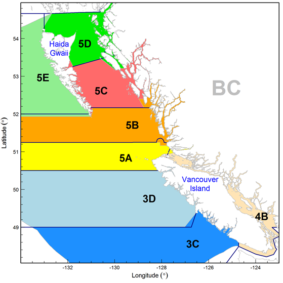

background-image: url(figs/arrowtooth_flounder.jpeg)

```{r setup, include=FALSE, echo=FALSE, fig.width=8, fig.height=8}
# paste this into the console before running `xaringan::inf_mr("twg_01.Rmd")`
# to make your entries faster (fraction of a second)
# options(servr.interval = 0.1)

fig_asp <- 0.618
fig_width <- 9
fig_out_width <- "6in"
fig_dpi <- 180
fig_align <- "center"
knitr::opts_chunk$set(
  collapse = TRUE,
  warning = FALSE,
  message = FALSE,
  comment = "#>",
  fig.asp = fig_asp,
  fig.width = fig_width,
  fig.path = "_bookdown_files/knitr-cache/",
  cache.path = "_bookdown_files/knitr-cache/",
  echo = FALSE,
  cache.comments = FALSE,
  dev = "png",
  dpi = fig_dpi,
  fig.align = fig_align
)

french <- FALSE

options(htmltools.dir.version = FALSE)
library(cowplot)
library(csasdown)
library(dplyr)
library(here)
library(gfplot)
library(ggplot2)
library(knitr)
library(kableExtra)
library(purrr)
library(tibble)
library(tidyr)
#devtools::load_all(file.path(dirname(here()), "gfplot"))
library(arrowtooth)

main_dirs <- set_dirs(nongit_dir = file.path(dirname(here()), "arrowtooth-nongit"))
nongit_dir <- main_dirs$nongit_dir
if(!exists("dat")){
  fn <- file.path(nongit_dir, "data", "arrowtooth-flounder-june11-2021.rds")
  if(!file.exists(fn)){
    stop("Data file ", fn, " does not exist", call. = FALSE)
  }
  dat <- readRDS(fn)
}
pres_dir <- file.path(nongit_dir, "presentations", "pre-review")
survey_index <- dat$survey_index
survey_sets <- dat$survey_sets
survey_samples <- dat$survey_samples
commercial_samples <- dat$commercial_samples
catch <- dat$catch
cpue_spatial <- dat$cpue_spatial
catch_spatial <- dat$catch_spatial
cpue_spatial_ll <- dat$cpue_spatial_ll
age_precision <- dat$age_precision

# Make a tibble in ggplot format with length-based and possibly age-based sex proportions by year
get_female_props <- function(ac = NULL, lc){
  if(!is.null(ac)){
    ac_all <- ac %>% group_by(year) %>% summarize(num = n())
    ac_fem <- ac %>% group_by(year) %>% filter(sex == "F") %>% summarize(num = n())
    ac_all <- ac_all %>%
      left_join(ac_fem, by = "year") %>% 
      rename(all = num.x, female = num.y) %>%
      mutate(female_prop = round(female / all, 2),
             male_prop = round(1 - female_prop, 2)) 
    ac_all <- ac_all %>% 
      select(year, female_prop) %>% 
      mutate(type = "Age")
  }
  
  lc_all <- lc %>% group_by(year) %>% summarize(num = n())
  lc_fem <- lc %>% group_by(year) %>% filter(sex == "F") %>% summarize(num = n())
  lc_all <- lc_all %>%
    left_join(lc_fem, by = "year") %>% 
    rename(all = num.x, female = num.y) %>%
    mutate(female_prop = round(female / all, 2),
           male_prop = round(1 - female_prop, 2)) 
  lc_all <- lc_all %>% 
    select(year, female_prop) %>% 
    mutate(type = "Length")
  
  if(is.null(ac)){
    lc_all %>% 
      rename(Year = year, `Proportion female` = female_prop, `Type` = type)
  }else{
    bind_rows(ac_all, lc_all) %>% 
      rename(Year = year, `Proportion female` = female_prop, `Type` = type)
  }
}

# Commercial samples
# Coastwide
ct_coast <- tidy_catch(catch, areas = NULL)
ct_areas <- tidy_catch(catch, areas = c("3[CD]+", "5[ABCDE]+"))
ct_areas_fine <- tidy_catch(catch, areas = c("3[CD]+", "5[AB]+", "5[CD]", "5[E]"))
ac_coast <- tidy_ages_weighted(commercial_samples, sample_type = "commercial", dat_catch = catch)
lc_coast <- tidy_lengths_weighted(commercial_samples, sample_type = "commercial", dat_catch = catch)
ac_lc_coast <- get_female_props(ac_coast, lc_coast) %>% mutate(Area = "Coastwide")
lwf_coast <- fit_length_weight(commercial_samples, sex = "female")
lwm_coast <- fit_length_weight(commercial_samples, sex = "male")
num_m_coast <- commercial_samples %>% filter(!is.na(weight) & !is.na(length), sex == 1) %>% nrow
num_f_coast <- commercial_samples %>% filter(!is.na(weight) & !is.na(length), sex == 2) %>% nrow
# 3CD
cs_3cd <- commercial_samples %>% filter(grepl("^3[C|D].*", major_stat_area_name))
ac_3cd <- tidy_ages_weighted(cs_3cd, sample_type = "commercial", dat_catch = catch)
lc_3cd <- tidy_lengths_weighted(cs_3cd, sample_type = "commercial", dat_catch = catch)
ac_lc_3cd <- get_female_props(ac_3cd, lc_3cd) %>% mutate(Area = "3CD")
lwf_3cd <- fit_length_weight(cs_3cd, sex = "female")
lwm_3cd <- fit_length_weight(cs_3cd, sex = "male")
num_m_3cd <- cs_3cd %>% filter(!is.na(weight) & !is.na(length), sex == 1) %>% nrow
num_f_3cd <- cs_3cd %>% filter(!is.na(weight) & !is.na(length), sex == 2) %>% nrow
# 5AB
cs_5ab <- commercial_samples %>% filter(grepl("^5[A|B].*", major_stat_area_name))
ac_5ab <- tidy_ages_weighted(cs_5ab, sample_type = "commercial", dat_catch = catch)
lc_5ab <- tidy_lengths_weighted(cs_5ab, sample_type = "commercial", dat_catch = catch)
ac_lc_5ab <- get_female_props(ac_5ab, lc_5ab) %>% mutate(Area = "5AB")
lwf_5ab <- fit_length_weight(cs_5ab, sex = "female")
lwm_5ab <- fit_length_weight(cs_5ab, sex = "male", min_samples = 25)
num_m_5ab <- cs_5ab %>% filter(!is.na(weight) & !is.na(length), sex == 1) %>% nrow
num_f_5ab <- cs_5ab %>% filter(!is.na(weight) & !is.na(length), sex == 2) %>% nrow
# 5CD
cs_5cd <- commercial_samples %>% filter(grepl("^5[C|D].*", major_stat_area_name))
ac_5cd <- tidy_ages_weighted(cs_5cd, sample_type = "commercial", dat_catch = catch)
lc_5cd <- tidy_lengths_weighted(cs_5cd, sample_type = "commercial", dat_catch = catch)
ac_lc_5cd <- get_female_props(ac_5cd, lc_5cd) %>% mutate(Area = "5CD")
lwf_5cd <- fit_length_weight(cs_5cd, sex = "female")
lwm_5cd <- fit_length_weight(cs_5cd, sex = "male")
num_m_5cd <- cs_5cd %>% filter(!is.na(weight) & !is.na(length), sex == 1) %>% nrow
num_f_5cd <- cs_5cd %>% filter(!is.na(weight) & !is.na(length), sex == 2) %>% nrow
# 5E
cs_5e <- commercial_samples %>% filter(grepl("^5[E].*", major_stat_area_name))
lc_5e <- tidy_lengths_weighted(cs_5e, sample_type = "commercial", dat_catch = catch)
ac_lc_5e <- get_female_props(lc = lc_5e) %>% mutate(Area = "5E")
lwf_5e <- fit_length_weight(cs_5e, sex = "female")
lwm_5e <- fit_length_weight(cs_5e, sex = "male")
num_m_5e <- cs_5e %>% filter(!is.na(weight) & !is.na(length), sex == 1) %>% nrow
num_f_5e <- cs_5e %>% filter(!is.na(weight) & !is.na(length), sex == 2) %>% nrow

ac_lc <- bind_rows(ac_lc_coast, ac_lc_3cd, ac_lc_5ab, ac_lc_5cd, ac_lc_5e)

# Survey samples
# Coastwide
ss_coast <- survey_samples %>%
  filter(survey_abbrev %in% c("SYN WCVI", "SYN QCS", "SYN HS", "HS MSA"))
as_coast <- ss_coast %>%
  tidy_ages_weighted(sample_type = "survey",
                     dat_survey_sets = survey_sets) %>% 
  mutate(survey_abbrev = as.character(survey_abbrev))
ls_coast <- tidy_lengths_weighted(survey_samples,
                                  sample_type = "survey",
                                  dat_survey_sets = survey_sets)
as_ls_coast <- get_female_props(as_coast, ls_coast) %>% mutate(Area = "All surveys")
# 3CD
ss_3cd <- survey_samples %>% filter(survey_abbrev == "SYN WCVI")
as_3cd <- tidy_ages_weighted(ss_3cd, sample_type = "survey", dat_survey_sets = survey_sets)
ls_3cd <- tidy_lengths_weighted(ss_3cd, sample_type = "survey", dat_survey_sets = survey_sets)
as_ls_3cd <- get_female_props(as_3cd, ls_3cd) %>% mutate(Area = "SYN WCVI")
# 5AB
ss_5ab <- survey_samples %>% filter(survey_abbrev == "SYN QCS")
as_5ab <- tidy_ages_weighted(ss_5ab, sample_type = "survey", dat_survey_sets = survey_sets)
ls_5ab <- tidy_lengths_weighted(ss_5ab, sample_type = "survey", dat_survey_sets = survey_sets)
as_ls_5ab <- get_female_props(as_5ab, ls_5ab) %>% mutate(Area = "SYN QCS")
# 5CD
ss_5cd <- survey_samples %>% filter(survey_abbrev == "SYN HS")
as_5cd <- tidy_ages_weighted(ss_5cd, sample_type = "survey", dat_survey_sets = survey_sets)
ls_5cd <- tidy_lengths_weighted(ss_5cd, sample_type = "survey", dat_survey_sets = survey_sets)
as_ls_5cd <- get_female_props(as_5cd, ls_5cd) %>% mutate(Area = "SYN HS")
# 5E
ss_5e <- survey_samples %>% filter(survey_abbrev == "SYN WCHG")
ls_5e <- tidy_lengths_weighted(ss_5e, sample_type = "survey", dat_survey_sets = survey_sets)
as_ls_5e <- get_female_props(lc = ls_5e) %>% mutate(Area = "SYN WCHG")

as_ls <- bind_rows(as_ls_coast, as_ls_3cd, as_ls_5ab, as_ls_5cd, as_ls_5e)

theme_set(theme_pbs())
```

```{r xaringan-themer, include=FALSE, warning=FALSE}
library(xaringanthemer)
style_mono_accent(
  base_color = "#1c5253",
  header_font_google = google_font("Josefin Sans"),
  text_font_google   = google_font("Montserrat", "300", "300i"),
  code_font_google   = google_font("Fira Mono")
)
```

---
class: center, middle, inverse

# Commercial Fishery data

---
class: center
### Introduction

.left[
- Bottom trawl fishery

- Prior to freezer trawlers, much of the catch was discarded at sea due to proteolysis

- Catch data prior to 1996 are unreliable due to lack of reporting of discards. Entire tows were discarded without report often.

- Previous assessment: Grandin & Forrest, 2017 (modeling and assessment took place in 2015 for years 1996-2014)
  - Female-only, coastwide catch-age model (iSCAM)
]

---
class: center
### Management

.left[
- Managed as a coastwide stock

- Recent measures imposed while waiting for advice from this stock assessment

  - Reduced 2019/2020 carryover allowance from 30% to 10%

  - Reduced TAC from 14,000 t to 5,000 t in 2020/2021

  - Reduced temporary quota size from 16% to 8% of the TAC

  - Implementation of spatial closures from Nov 1 to March 31 to limit harvest on spawners
]

---
class: center
### Management Areas
```{r management-areas, out.width = 550}

```

---
class: center
### Catch / CPUE Coastwide 2007-2020
.left-fig[
```{r catch-spatial-all, fig.dim = c(4.8, 4.5), out.width = "100%"}
plot_catch_spatial(catch_spatial %>% filter(year %in% 2007:2020),
                        bin_width = 10,
                        bath = c(100, 200, 500, 1000, 1500)) +
  theme(axis.text.x = element_text(angle = 0)) +
  ggtitle("2007-2020") +
  theme(plot.title = element_text(size = 20, face = "bold")) +
  scale_x_continuous(breaks = seq(from = 1900, to = 2100, by = 5))

```
]
.right-fig[
```{r cpue-spatial-all, echo = FALSE, fig.dim = c(4.8, 4.5), out.width = "100%"}
plot_cpue_spatial(cpue_spatial %>% filter(year %in% 2007:2020),
                       bin_width = 10,
                       bath = c(100, 200, 500, 1000, 1500)) +
  theme(axis.text.x = element_text(angle = 0)) +
  ggtitle("2007-2020") +
  theme(plot.title = element_text(size = 20, face = "bold")) +
  scale_x_continuous(breaks = seq(from = 1900, to = 2100, by = 5))

```
]

---
class: center
### Catch / CPUE Coastwide 2015
.left-fig[
```{r catch-spatial-2015, fig.dim = c(4.8, 4.5), out.width = "100%"}
plot_catch_spatial(catch_spatial %>% filter(year == 2015),
                        bin_width = 10,
                        bath = c(100, 200, 500, 1000, 1500)) +
  theme(axis.text.x = element_text(angle = 0)) +
  ggtitle("2015") +
  theme(plot.title = element_text(size = 20, face = "bold")) +
  scale_x_continuous(breaks = seq(from = 1900, to = 2100, by = 5))

```
]
.right-fig[
```{r cpue-spatial-2015, echo = FALSE, fig.dim = c(4.8, 4.5), out.width = "100%"}
plot_cpue_spatial(cpue_spatial %>% filter(year == 2015),
                       bin_width = 10,
                       bath = c(100, 200, 500, 1000, 1500)) +
  theme(axis.text.x = element_text(angle = 0)) +
  ggtitle("2015") +
  theme(plot.title = element_text(size = 20, face = "bold")) +
  scale_x_continuous(breaks = seq(from = 1900, to = 2100, by = 5))

```
]

---
class: center
### Catch / CPUE Coastwide 2016
.left-fig[
```{r catch-spatial-2016, fig.dim = c(4.8, 4.5), out.width = "100%"}
plot_catch_spatial(catch_spatial %>% filter(year == 2016),
                        bin_width = 10,
                        bath = c(100, 200, 500, 1000, 1500)) +
  theme(axis.text.x = element_text(angle = 0)) +
  ggtitle("2016") +
  theme(plot.title = element_text(size = 20, face = "bold")) +
  scale_x_continuous(breaks = seq(from = 1900, to = 2100, by = 5))

```
]
.right-fig[
```{r cpue-spatial-2016, echo = FALSE, fig.dim = c(4.8, 4.5), out.width = "100%"}
plot_cpue_spatial(cpue_spatial %>% filter(year == 2016),
                       bin_width = 10,
                       bath = c(100, 200, 500, 1000, 1500)) +
  theme(axis.text.x = element_text(angle = 0)) +
  ggtitle("2016") +
  theme(plot.title = element_text(size = 20, face = "bold")) +
  scale_x_continuous(breaks = seq(from = 1900, to = 2100, by = 5))

```
]

---
class: center
### Catch / CPUE Coastwide 2017
.left-fig[
```{r catch-spatial-2017, fig.dim = c(4.8, 4.5), out.width = "100%"}
plot_catch_spatial(catch_spatial %>% filter(year == 2017),
                        bin_width = 10,
                        bath = c(100, 200, 500, 1000, 1500)) +
  theme(axis.text.x = element_text(angle = 0)) +
  ggtitle("2017") +
  theme(plot.title = element_text(size = 20, face = "bold")) +
  scale_x_continuous(breaks = seq(from = 1900, to = 2100, by = 5))

```
]
.right-fig[
```{r cpue-spatial-2017, echo = FALSE, fig.dim = c(4.8, 4.5), out.width = "100%"}
plot_cpue_spatial(cpue_spatial %>% filter(year == 2017),
                       bin_width = 10,
                       bath = c(100, 200, 500, 1000, 1500)) +
  theme(axis.text.x = element_text(angle = 0)) +
  ggtitle("2017") +
  theme(plot.title = element_text(size = 20, face = "bold")) +
  scale_x_continuous(breaks = seq(from = 1900, to = 2100, by = 5))

```
]

---
class: center
### Catch / CPUE Coastwide 2018
.left-fig[
```{r catch-spatial-2018, fig.dim = c(4.8, 4.5), out.width = "100%"}
plot_catch_spatial(catch_spatial %>% filter(year == 2018),
                        bin_width = 10,
                        bath = c(100, 200, 500, 1000, 1500)) +
  theme(axis.text.x = element_text(angle = 0)) +
  ggtitle("2018") +
  theme(plot.title = element_text(size = 20, face = "bold")) +
  scale_x_continuous(breaks = seq(from = 1900, to = 2100, by = 5))

```
]
.right-fig[
```{r cpue-spatial-2018, echo = FALSE, fig.dim = c(4.8, 4.5), out.width = "100%"}
plot_cpue_spatial(cpue_spatial %>% filter(year == 2018),
                       bin_width = 10,
                       bath = c(100, 200, 500, 1000, 1500)) +
  theme(axis.text.x = element_text(angle = 0)) +
  ggtitle("2018") +
  theme(plot.title = element_text(size = 20, face = "bold")) +
  scale_x_continuous(breaks = seq(from = 1900, to = 2100, by = 5))

```
]

---
class: center
### Catch / CPUE Coastwide 2019
.left-fig[
```{r catch-spatial-2019, fig.dim = c(4.8, 4.5), out.width = "100%"}
plot_catch_spatial(catch_spatial %>% filter(year == 2019),
                        bin_width = 10,
                        bath = c(100, 200, 500, 1000, 1500)) +
  theme(axis.text.x = element_text(angle = 0)) +
  ggtitle("2019") +
  theme(plot.title = element_text(size = 20, face = "bold")) +
  scale_x_continuous(breaks = seq(from = 1900, to = 2100, by = 5))

```
]
.right-fig[
```{r cpue-spatial-2019, echo = FALSE, fig.dim = c(4.8, 4.5), out.width = "100%"}
plot_cpue_spatial(cpue_spatial %>% filter(year == 2019),
                       bin_width = 10,
                       bath = c(100, 200, 500, 1000, 1500)) +
  theme(axis.text.x = element_text(angle = 0)) +
  ggtitle("2019") +
  theme(plot.title = element_text(size = 20, face = "bold")) +
  scale_x_continuous(breaks = seq(from = 1900, to = 2100, by = 5))

```
]

---
class: center
### Catch / CPUE Coastwide 2020
.left-fig[
```{r catch-spatial-2020, fig.dim = c(4.8, 4.5), out.width = "100%"}
plot_catch_spatial(catch_spatial %>% filter(year == 2020),
                        bin_width = 10,
                        bath = c(100, 200, 500, 1000, 1500)) +
  theme(axis.text.x = element_text(angle = 0)) +
  ggtitle("2020") +
  theme(plot.title = element_text(size = 20, face = "bold")) +
  scale_x_continuous(breaks = seq(from = 1900, to = 2100, by = 5))

```
]
.right-fig[
```{r cpue-spatial-2020, echo = FALSE, fig.dim = c(4.8, 4.5), out.width = "100%"}
plot_cpue_spatial(cpue_spatial %>% filter(year == 2020),
                       bin_width = 10,
                       bath = c(100, 200, 500, 1000, 1500)) +
  theme(axis.text.x = element_text(angle = 0)) +
  ggtitle("2020") +
  theme(plot.title = element_text(size = 20, face = "bold")) +
  scale_x_continuous(breaks = seq(from = 1900, to = 2100, by = 5))

```
]


---
class: center
### Total coastwide catch
```{r main-catches}
plot_catch(ct_coast, french = french, xlim = c(start_catch_yr, end_catch_yr)) +
  theme(axis.text.x = element_text(angle = 0)) +
  ggtitle(NULL) +
  scale_x_continuous(breaks = seq(from = 1900, to = 2100, by = 5))
```

---
class: center
### Total catch split North/South
```{r main-catches-by-area}
# Place North on top and South on bottom for facets
ct_areas$area <- factor(ct_areas$area, levels = rev(unique(ct_areas$area)))
plot_catch(ct_areas, french = french, xlim = c(start_catch_yr, end_catch_yr)) +
  theme(axis.text.x = element_text(angle = 0)) +
  ggtitle(NULL) +
  scale_x_continuous(breaks = seq(from = 1900, to = 2100, by = 5))
```

---
class: center
### Total catch by area
```{r main-catches-by-area-fine}
# Place North on top and South on bottom for facets
ct_areas_fine$area <- factor(ct_areas_fine$area, levels = rev(unique(ct_areas_fine$area)))
plot_catch(ct_areas_fine, french = french, xlim = c(start_catch_yr, end_catch_yr)) +
  theme(axis.text.x = element_text(angle = 0)) +
  ggtitle(NULL) +
  scale_x_continuous(breaks = seq(from = 1900, to = 2100, by = 5))
```

---
class: center
### Number of fishery age observations
```{r age-freq}
j <- map2(list(commercial_samples, cs_3cd, cs_5ab, cs_5cd, cs_5e),
          c("Coastwide", "3CD", "5AB", "5CD", "5E"), ~{
  .x %>%
    select(year, sex, age) %>%
    filter(!is.na(age)) %>% 
    mutate(sex = ifelse(sex == 1, "Male", ifelse(sex == 2, "Female", "Not recorded"))) %>% 
              rename(Year = year, Age = age, Sex = sex) %>% 
              mutate(Area = .y)}) %>% 
  map_df(~{.x}) %>% 
  complete(Year, Sex, Area)

ggplot(j, aes(x = Year, fill = Sex, color = Sex)) +
  geom_bar() +
  scale_fill_manual(values = c(Female = "#FF00001A", Male = "#0000FF1A", `Not recorded` = "#6666661A"),
                    aesthetics = "fill") +
  scale_color_manual(values = c(Female = "red", Male = "blue", `Not recorded` = "grey40"),
                    aesthetics = "color") +
  facet_wrap(~ Area) +
  ylab("Number of length records") +
  scale_y_continuous(labels = scales::comma)
```

---
class: center
### Age proportions coastwide
```{r age-comps}
plot_ages(ac_coast, diagonal_lines = NA) +
  theme(axis.text.x = element_text(angle = 0, hjust = 0.5)) +
  scale_color_manual(values = c(F = "#FF000080", M = "#0000FF80"),
                    aesthetics = "color") +
  ggtitle(NULL) +
  scale_x_continuous(breaks = seq(from = 1900, to = 2100, by = 1))
```

---
class: center
### Age proportions area 3CD
```{r age-comps-3cd}
plot_ages(ac_3cd, diagonal_lines = NA) +
  theme(axis.text.x = element_text(angle = 0, hjust = 0.5)) +
  scale_color_manual(values = c(F = "#FF000080", M = "#0000FF80"),
                    aesthetics = "color") +
  ggtitle(NULL) +
  scale_x_continuous(breaks = seq(from = 1900, to = 2100, by = 1))
```

---
class: center
### Age proportions area 5AB
```{r age-comps-5ab}
plot_ages(ac_5ab, diagonal_lines = NA) +
  theme(axis.text.x = element_text(angle = 0, hjust = 0.5)) +
  scale_color_manual(values = c(F = "#FF000080", M = "#0000FF80"),
                    aesthetics = "color") +
  ggtitle(NULL) +
  scale_x_continuous(breaks = seq(from = 1900, to = 2100, by = 1))
```

---
class: center
### Age proportions area 5CD
```{r age-comps-5cd}
plot_ages(ac_5cd, diagonal_lines = NA) +
  theme(axis.text.x = element_text(angle = 0, hjust = 0.5)) +
  scale_color_manual(values = c(F = "#FF000080", M = "#0000FF80"),
                    aesthetics = "color") +
  ggtitle(NULL) +
  scale_x_continuous(breaks = seq(from = 1900, to = 2100, by = 1))
```

---
class: center
### Number of fishery length observations
```{r length-freq}
k <- map2(list(cs_3cd, cs_5ab, cs_5cd, cs_5e),
          c("3CD", "5AB", "5CD", "5E"), ~{
  .x %>%
    select(year, sex, length) %>%
    filter(!is.na(length)) %>% 
    mutate(sex = ifelse(sex == 1, "Male", ifelse(sex == 2, "Female", "Not recorded"))) %>% 
              rename(Year = year, Length = length, Sex = sex) %>% 
              mutate(Area = .y)}) %>% 
  map_df(~{.x}) %>% 
  complete(Year, Sex, Area)

ggplot(k, aes(x = Year, fill = Sex, color = Sex)) +
  geom_bar() +
  scale_fill_manual(values = c(Female = "#FF00001A", Male = "#0000FF1A", `Not recorded` = "#6666661A"),
                    aesthetics = "fill") +
  scale_color_manual(values = c(Female = "red", Male = "blue", `Not recorded` = "grey40"),
                    aesthetics = "color") +
  facet_wrap(~ Area) +
  ylab("Number of length records") +
  scale_y_continuous(labels = scales::comma)
```

---
class: center
### Number of fishery length observations coastwide
```{r length-freq-coastwide}
j <- commercial_samples %>% 
  select(year, sex, length) %>%
  filter(!is.na(length)) %>% 
  mutate(sex = ifelse(sex == 1, "Male", ifelse(sex == 2, "Female", "Not recorded"))) %>% 
  rename(Year = year, Length = length, Sex = sex) %>% 
  complete(Year, Sex) 

ggplot(j, aes(x = Year, fill = Sex, color = Sex)) +
  geom_bar() +
  scale_fill_manual(values = c(Female = "#FF00001A", Male = "#0000FF1A", `Not recorded` = "#6666661A"),
                    aesthetics = "fill") +
  scale_color_manual(values = c(Female = "red", Male = "blue", `Not recorded` = "grey40"),
                    aesthetics = "color") +
  ylab("Number of length records") +
  scale_y_continuous(labels = scales::comma)
```

---
class: center
### Length proportions coastwide
```{r length-comps}
fm_fill_colors <- c(M = "#0000FF1A", F = "#FF00001A")
fm_line_colors <- c(M = "blue", F = "red")
plot_lengths(lc_coast, show_year = "even", fill_col = fm_fill_colors, line_col = fm_line_colors) +
  ggtitle(NULL) +
  scale_x_continuous(breaks = seq(from = 0, to = 100, by = 5))
```

---
class: center
### Length proportions 3CD
```{r length-comps-3cd}
plot_lengths(lc_3cd, show_year = "even", fill_col = fm_fill_colors, line_col = fm_line_colors) +
  ggtitle(NULL) +
  scale_x_continuous(breaks = seq(from = 0, to = 100, by = 5))
```

---
class: center
### Length proportions 5AB
```{r length-comps-5ab}
plot_lengths(lc_5ab, show_year = "even", fill_col = fm_fill_colors, line_col = fm_line_colors) +
  ggtitle(NULL) +
  scale_x_continuous(breaks = seq(from = 0, to = 100, by = 5))
```

---
class: center
### Length proportions 5CD
```{r length-comps-5cd}
plot_lengths(lc_5cd, show_year = "all", fill_col = fm_fill_colors, line_col = fm_line_colors) +
  ggtitle(NULL) +
  scale_x_continuous(breaks = seq(from = 0, to = 100, by = 5))
```

---
class: center
### Length proportions 5E
```{r length-comps-5e}
plot_lengths(lc_5e, show_year = "all", fill_col = fm_fill_colors, line_col = fm_line_colors) +
  ggtitle(NULL) +
  scale_x_continuous(breaks = seq(from = 0, to = 100, by = 5))
```

---
class: center
### Length-weight relationships

```{r lw-relationship}
fm_color <- c(Male = "blue", Female = "red")
plot_grid(plot_length_weight(lwf_3cd, lwm_3cd, col = fm_color) +
            theme(legend.position = "none") +
            ggtitle(paste0("3CD (", num_f_3cd, " F, ", num_m_3cd, " M)")),
          plot_length_weight(lwf_5ab, lwm_5ab, col = fm_color) +
            theme(legend.position = "none") +
            ggtitle(paste0("5AB (", num_f_5ab, " F, ", num_m_5ab, " M)")),
          plot_length_weight(lwf_5cd, lwm_5cd, col = fm_color) +
            theme(legend.position = "none") +
            ggtitle(paste0("5CD (", num_f_5cd, " F, ", num_m_5cd, " M)")),
          plot_length_weight(lwf_5e, lwm_5e, col = fm_color) +
            theme(legend.position = "none") +
            ggtitle(paste0("5E (", num_f_5e, " F, ", num_m_5e, " M)")),
          plot_length_weight(lwf_coast, lwm_coast, col = fm_color) +
            theme(legend.position = "none") +
            ggtitle(paste0("Coastwide (", num_f_coast, " F, ", num_m_coast, " M)")),
          ncol = 3,
          nrow = 2)
```

---
class: center
### Sex proportions

```{r sex-comp-compare-coast}
ggplot(ac_lc, aes(x = Year, y = `Proportion female`, color = `Type`)) +
  geom_line(size = 1) +
  geom_hline(yintercept = c(0.5, 0.75), linetype = "dashed") +
  coord_cartesian(ylim = c(0, 1)) +
  facet_wrap(~Area) 
  #theme_xaringan(background_color = "#FFFFFF", text_font_size = 10) 

```

---
class: center
### Coastwide sex proportions with weighting applied

```{r sex-prop-weighting-older, echo = FALSE, message = FALSE}
unsorted_only <- props_comm(commercial_samples,
                            areas = c("03", "04", "05", "06", "07", "08", "09"),
                            start_year = 1996,
                            species_category = c(1),
                            sample_type = c(1, 2, 6, 7, 8),
                            gear = c(1, 8),
                            data_source_name = "Unsorted only")
no_unsorted <- props_comm(commercial_samples,
                          areas = c("03", "04", "05", "06", "07", "08", "09"),
                          start_year = 1996,
                          species_category = c(0, 2, 3, 4),
                          sample_type = c(1, 2, 6, 7, 8),
                          gear = c(1, 8),
                          data_source_name = "No unsorted")
no_keepers <- props_comm(commercial_samples,
                         areas = c("03", "04", "05", "06", "07", "08", "09"),
                         start_year = 1996,
                         species_category = c(0, 1, 2, 4),
                         sample_type = c(1, 2, 6, 7, 8),
                         gear = c(1, 8),
                         data_source_name = "No keepers")
no_discards <- props_comm(commercial_samples,
                          areas = c("03", "04", "05", "06", "07", "08", "09"),
                          start_year = 1996,
                          species_category = c(0, 1, 2, 3),
                          sample_type = c(1, 2, 6, 7, 8),
                          gear = c(1, 8),
                          data_source_name = "No discards")
no_unknown <- props_comm(commercial_samples,
                         areas = c("03", "04", "05", "06", "07", "08", "09"),
                         start_year = 1996,
                         species_category = c(1, 2, 3, 4),
                         sample_type = c(1, 2, 6, 7, 8),
                         gear = c(1, 8),
                         data_source_name = "No unknown")
all <- props_comm(commercial_samples,
                  areas = c("03", "04", "05", "06", "07", "08", "09"),
                  start_year = 1996,
                  species_category = c(0, 1, 2, 3, 4),
                  sample_type = c(1, 2, 6, 7, 8),
                  gear = c(1, 8),
                  data_source_name = "all types")

j <- bind_rows(unsorted_only, no_unsorted, no_keepers, no_discards, no_unknown, all) %>% 
  pivot_wider(id_cols = "year", names_from = "data_source", values_from = prop_female) %>% 
  arrange(year) %>% 
  rename(Year = year) %>% 
  mutate_at(.vars = vars(-Year), function(x){format(round(x, 2), nsmall = 2)}) %>% 
  map_df(~{
    .x[grep("NA", .x)] <- ""
    .x
  })

older <- j %>% filter(Year <= 2007) %>% 
  mutate(`No keepers` = cell_spec(`No keepers`,
                                  color = ifelse(`No keepers` < 0.4, "white", "black"),
                                  background = ifelse(`No keepers` < 0.4, "red", "white"),
                                  bold = ifelse(`No keepers` < 0.4, TRUE, FALSE)))
newer <- j %>% filter(Year > 2007)
kable(older, booktabs = TRUE, escape = FALSE, table.attr = "style='width:100%;'") %>% 
  row_spec(seq(1, nrow(older)), background = "white") %>% 
  kable_styling(font_size = 18)

```

---
class: center
### Coastwide sex proportions with weighting applied (2)
```{r sex-prop-weighting-newer, echo = FALSE, message = FALSE}
kable(newer, booktabs = TRUE, escape = FALSE, table.attr = "style='width:100%;'") %>% 
  row_spec(seq(1, nrow(newer)), background = "white") %>% 
  kable_styling(font_size = 18)
```

---
class: center
### Coastwide sex proportions with weighting applied (3)
```{r sex-prop-weighting-with-surveys, echo = FALSE, message = FALSE}
out_dir <- file.path(nongit_dir, "data-output")
fn <- file.path(out_dir, "all-proportion-female.rds")
if(!dir.exists(out_dir)){
  dir.create(out_dir)
}
if(file.exists(fn)){
  all_props <- readRDS(fn)
}else{
  all_props <- props_all(comm_samples = commercial_samples,
                         surv_sets = survey_sets,
                         surv_samples = survey_samples,
                         surv_series = 1:4,
                         surv_series_names = c("qcsss", "hsmas", "hsss", "wcviss"),
                         start_year = 1996,
                         end_year = 2019,
                         species_category = c(0, 1, 2, 3, 4),
                         sample_type = c(1, 2, 6, 7, 8),
                         gear = c(1, 8))
  saveRDS(all_props, fn)  
}

all_props <- all_props %>% pivot_wider(id_cols = "year", names_from = "data_source", values_from = "prop_female") %>% 
  mutate_at(.vars = vars(-year), ~{format(round(.x, 2), nsmall = 2)}) %>% 
  map_df(~{
    .x[grep("NA", .x)] <- ""
    .x
  }) %>% 
  rename(`Year` = "year",
         `QCS Synoptic` = "qcsss",
         `HS Multispecies` = "hsmas",
         `HS Synoptic` = "hsss",
         `WCVI Synoptic` = "wcviss")

all_props_older <- all_props %>% filter(Year <= 2007)
all_props_newer <- all_props %>% filter(Year > 2007)
    
kable(all_props_older, booktabs = TRUE, escape = FALSE, table.attr = "style='width:100%;'") %>% 
  row_spec(seq(1, nrow(all_props_older)), background = "white") %>% 
  kable_styling(font_size = 18)
```

---
class: center
### Coastwide sex proportions with weighting applied (4)
```{r sex-prop-weighting-with-surveys-2, echo = FALSE, message = FALSE}
kable(all_props_newer, booktabs = TRUE, escape = FALSE, table.attr = "style='width:100%;'") %>% 
  row_spec(seq(1, nrow(all_props_newer)), background = "white") %>% 
  kable_styling(font_size = 18)
```

---
class: center, inverse, middle
# Survey data

---
class: center
### Sample availibility

```{r sample-availability}
surv_samp <- tidy_sample_avail(survey_samples)
plot_sample_avail(surv_samp, palette = "Greens", text_colour = "black")
```

---
class: center
### Survey Indices

```{r survey-indices}
surv_indices <- tidy_survey_index(survey_index)
plot_survey_index(surv_indices, col = c("lightblue", "black"))
```

---
class: center
### Survey biomass for SYN WCVI

```{r survey-sets-wcvi, animation.hook="gifski", interval=2}
for(i in seq(2004, 2018, by = 2)){
  rds_file <- file.path(pres_dir, paste0("survey-sets-wcvi-", i, ".rds"))
  if(file.exists(rds_file)){
    surv_sets <- readRDS(rds_file)
  }else{
    surv_sets <- fit_survey_sets(survey_sets,
                                 years = i,
                                 survey = "SYN WCVI")
    saveRDS(surv_sets, rds_file)    
  }
  g <- plot_survey_sets(surv_sets$predictions,
                        surv_sets$data, 
                        fill_column = "combined") +
    ggtitle(label = i) +
    theme(plot.title = element_text(size = 24, face = "bold"))
  print(g)
}
```

---
class: center
### Survey biomass for SYN QCS

```{r survey-sets-qcs, animation.hook="gifski", interval=2}
for(i in c(2003, 2004, seq(2003, 2019, by = 2))){
  rds_file <- file.path(pres_dir, paste0("survey-sets-qcs-", i, ".rds"))
  if(file.exists(rds_file)){
    surv_sets <- readRDS(rds_file)
  }else{
    surv_sets <- fit_survey_sets(survey_sets,
                                 years = i,
                                 survey = "SYN QCS")
    saveRDS(surv_sets, rds_file)    
  }
  g <- plot_survey_sets(surv_sets$predictions,
                        surv_sets$data, 
                        fill_column = "combined") +
    ggtitle(label = i) +
    theme(plot.title = element_text(size = 24, face = "bold"))
  print(g)
}
```

---
class: center
### Survey biomass for SYN HS

```{r survey-sets-hs, animation.hook="gifski", interval=2}
for(i in seq(2005, 2019, by = 2)){
  rds_file <- file.path(pres_dir, paste0("survey-sets-hs-", i, ".rds"))
  if(file.exists(rds_file)){
    surv_sets <- readRDS(rds_file)
  }else{
    surv_sets <- fit_survey_sets(survey_sets,
                                 years = i,
                                 survey = "SYN HS")
    saveRDS(surv_sets, rds_file)    
  }
  g <- plot_survey_sets(surv_sets$predictions,
                        surv_sets$data, 
                        fill_column = "combined") +
    ggtitle(label = i) +
    theme(plot.title = element_text(size = 24, face = "bold"))
  print(g)
}
```

---
class: center
### Survey biomass for SYN WCHG

```{r survey-sets-wchg, animation.hook="gifski", interval=2}
for(i in c(2006, 2008, 2010, 2012, 2014, 2016, 2018)){
  rds_file <- file.path(pres_dir, paste0("survey-sets-wchg-", i, ".rds"))
  if(file.exists(rds_file)){
    surv_sets <- readRDS(rds_file)
  }else{
    surv_sets <- fit_survey_sets(survey_sets,
                                 years = i,
                                 survey = "SYN WCHG")
    saveRDS(surv_sets, rds_file)    
  }
  g <- plot_survey_sets(surv_sets$predictions,
                        surv_sets$data, 
                        fill_column = "combined") +
    ggtitle(label = i) +
    theme(plot.title = element_text(size = 24, face = "bold"))
  print(g)
}
```

---
class: center
### Number of SYN WCVI survey age observations
```{r survey-age-freq}
j <- map2(list(survey_samples, ss_3cd, ss_5ab, ss_5cd),
          c("Coastwide", "3CD (SYN WCVI)", "5AB (SYN QCS)", "5CD (SYN HS)"), ~{
  .x %>%
    select(year, sex, age) %>%
    filter(!is.na(age)) %>% 
    mutate(sex = ifelse(sex == 1, "Male", ifelse(sex == 2, "Female", "Not recorded"))) %>% 
              rename(Year = year, Age = age, Sex = sex) %>% 
              mutate(Area = .y)}) %>% 
  map_df(~{.x}) %>% 
  complete(Year, Sex, Area)

ggplot(j, aes(x = Year, fill = Sex, color = Sex)) +
  geom_bar() +
  scale_fill_manual(values = c(Female = "#FF00001A", Male = "#0000FF1A", `Not recorded` = "#6666661A"),
                    aesthetics = "fill") +
  scale_color_manual(values = c(Female = "red", Male = "blue", `Not recorded` = "grey40"),
                    aesthetics = "color") +
  facet_wrap(~ Area) +
  ylab("Number of length records") +
  scale_y_continuous(labels = scales::comma)
```

---
class: center
### Age proportions from surveys
```{r surveyage-comps-coastwide}
plot_ages(as_coast, diagonal_lines = NA) +
  theme(axis.text.x = element_text(angle = 45, hjust = 1)) +
  scale_color_manual(values = c(F = "#FF000080", M = "#0000FF80"),
                    aesthetics = "color") +
  ggtitle(NULL)
```

---
class: center
### Sex proportions

```{r survey-sex-comp-compare-coast}
ggplot(as_ls, aes(x = Year, y = `Proportion female`, color = `Type`)) +
  geom_line(size = 1) +
  geom_hline(yintercept = c(0.5, 0.75), linetype = "dashed") +
  coord_cartesian(ylim = c(0, 1)) +
  facet_wrap(~Area) 
  #theme_xaringan(background_color = "#FFFFFF", text_font_size = 10) 

```

---
class: center, middle, inverse
# Gulf of Alaska overview

---
class: center, inverse
### Gulf of Alaska assessment and management

.left[
- Single-area assessment

- Allowable Biological Catch (ABC) is apportioned by management area based on fraction of survey biomass in each

- Biennial assessment cycle
  - odd years have a stock assessment model run with two year projections and advice

  - even years have partial assessment showing only survey indices and catch

- Biomass for 2021 estimated at 1.325 million tonnes

- ABC for 2021 is 128,060 tonnes (F40%)

- Estimated catch for 2021 is 18,662 tonnes
]

---
class: center, inverse
### Gulf of Alaska 2019 biomass

```{r goa-bionass-2019-figure, out.width = 700}
include_graphics("figs/goa-2019-biomass.png")
```

---
class: center
### Gulf of Alaska assessment 2019 vs BC 2015

```{r goa-vs-bc}

d <- tribble(
                 ~Value,   ~`Gulf of Alaska 2019`,                 ~`BC 2015`,
      "Modeling platform",    "Stock Synthesis 3",    	              "iSCAM",
        "Number of sexes",                  "Two",             "One (Female)",
     "Commercial lengths",	      "Proxy for age",    	           "Not used",
        "Commercial ages",             "Not used",   	                 "Used",
            "Survey ages",	            "1 - 21+",                  "1 - 20+",
            "Selectivity",	          "Estimated",                "Estimated",
      "Natural mortality",	 "Fixed 0.2 (Female)", "Estimated 0.314 (Female)",
    "Survey catchability",	      "Fixed q = 1.0",                "Estimated",
            "Recruitment",	          "Estimated",                "Estimated",
 "Recruitment deviations",	          "Estimated",                "Estimated",
        "Steepness of SR",	         "No SR used",                "Estimated",
    "Age ot 50% maturity",	    "Age 7 (Females)",          "Age 6 (Females)")

kable(d, booktabs = TRUE, escape = FALSE, table.attr = "style='width:100%;'") %>% 
  row_spec(seq(1, nrow(d)), background = "white") %>% 
  kable_styling(font_size = 18)
```
